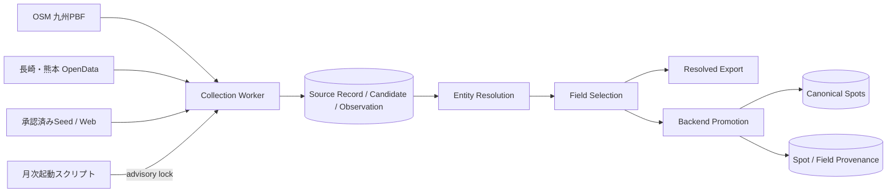

# Spotデータ収集機構 実装・収集結果 v1

## 目次

<inline-toc preview="3"></inline-toc>

## 1. 結論

Spotデータ収集機構は、九州7県を対象とするP0自動収集から、名寄せ、Field採用、BackendのCanonical Spot生成まで実行可能な状態である。

2026年10月10日にDocker上のDBを再集計した結果は次のとおりである。

- 九州7県一括バッチ: `completed`
- 一括バッチID: `6365da56-b31d-4ea2-9986-6484618a4d30`
- 一括バッチの処理件数: 29,000件
- 一括バッチ後のrefreshを含む最新Sourceレコード: 29,004件
- 名寄せ後Entity: 40,250件（現行40,245件、統合済み5件）
- 公開済みCanonical Spot: 25,934件
- 公開Spotに紐づくSource: 25,938件
- 公開Spotで採用済みのField出典: 212,171件
- Source未登録の公開Spot: 0件

「処理件数」「最新Sourceレコード」「Entity」「公開Spot」は同じものを数えていない。利用目的に応じて、次の基準を使い分ける。

- 収集処理の完走確認には、一括バッチの処理件数29,000件を使う。
- 現在の最新取得データ量には、refresh後の一意なSourceレコード29,004件を使う。
- アプリが利用する重複排除済み件数には、公開済みCanonical Spot 25,934件を使う。

## 2. 文書の対象と基準日時

本書は次の実装とデータを対象とする。

- Collection Worker: `data_collection/`
- Canonical promotionを含むBackend: `backend/`
- ローカル実行基盤: `compose.yaml`
- Source設定: `data_collection/config/sources.yaml`
- 九州Source台帳: `data_collection/config/kyushu_source_inventory.yaml`
- Collection migration: `data_collection/migrations/001_initial.sql`、`002_resolution_batches.sql`
- Backend migration: `backend/alembic/versions/`

件数は2026年10月10日にDocker上のPostgreSQL/PostGISを読み取り集計した。最後の収集処理は2026年10月7日00時23分頃（日本時間）に完了している。

## 3. 全体構成



責務は次のように分離されている。

- Collection WorkerはSource別レコードを削除せず保持し、候補、Observation、レビュー理由、Entity membershipを生成する。
- Entity Resolutionは複数Sourceの候補を同一Spotグループへまとめる。候補自体は上書き・物理削除しない。
- Field SelectionはEntityごとに採用するObservationと採用理由を保存する。
- BackendはEntityを1件のCanonical Spotとして公開し、全SourceとField単位の採用元を保存する。

## 4. 実装済み機能

### 4.1 収集、checkpoint、再開

- Adapterはページ単位の`DiscoveryPage`とcheckpointを返す。
- RunはSourceごとのpage、offset、最終item、完了状態を`collection_runs.checkpoint`へ保存する。
- 同じRunの再開では、設定hash、行政区域データ版、スキーマ版の互換性を検査する。
- item単位の一時失敗はattempt数と次回再試行時刻を保持し、Source全体の成果を破棄しない。
- `batches resume <batch_id> --failed-only`は未完了の子Runだけを対象にする。
- `refresh`ではcontent hashが変わらないレコードの再正規化を省略し、前回存在したが今回見つからないレコードには`not_seen_since`を設定する。

### 4.2 OSM PBF

- `osmium`でnode、way、areaをストリーム処理する。
- N03境界のbboxで事前絞り込みし、Shapelyで境界内判定する。
- ローカル`extract_path`とGeofabrikの`extract_url`に対応する。
- ダウンロードは一時ファイルへ保存後に置換し、ETag、Last-Modified、SHA-256、取得日時をmetadataへ保存する。
- OverpassとPBFはタグ判定、`type/id`形式の原典ID、座標計算、Observation変換を共通化している。
- wayとareaは代表点を使用し、座標を構成できないデータはレビュー対象にする。

今回使用したPBFは次のとおりである。

- URL: `https://download.geofabrik.de/asia/japan/kyushu-261005.osm.pbf`
- SHA-256: `2aca6871c596300d4bba9c2f24a19e1c1eed950736c06287aaa95a1b815d6acd`
- 取得日時: 2026年10月6日21時35分頃（日本時間）
- ライセンス: ODbL 1.0

### 4.3 公的OpenData

- CSV、JSON、GeoJSON、文字コード、列mapping、複合ID、必須列、対象地域コードを設定できる。
- ETag、Last-Modified、content hashを保持し、schema drift、必須列欠落、ID重複をSource単位で検知する。
- データセット、公開主体、ライセンス単位でSourceを分離する。
- 現在の九州一括profileには、利用条件を確認済みの長崎県と熊本県だけを登録している。

承認済みOpenDataは次の2件である。

- `nagasaki_tourism_open_data`: ながさき旅ネット観光スポット情報、CC BY 4.0
- `kumamoto_tourism_open_data`: 熊本県観光施設一覧、CC BY 4.0

福岡、佐賀、大分、宮崎、鹿児島は、県単位データの存在を仮定せず、未承認または利用可能な県単位データなしとしてSource inventoryへ記録している。

### 4.4 Entity ResolutionとField Selection

追加済みの主なテーブルは次のとおりである。

- `resolved_spot_entities`: 安定したEntity key、代表Candidate、状態、統合先
- `spot_entity_memberships`: Candidateの所属、match score、判定、根拠
- `entity_field_selections`: 採用Observation、採用score、rule version、理由
- `collection_batches`: 地域×Sourceの子Run、集約status、metrics、errors

候補ペアは、250m以内かつ名称類似度0.8以上、または正規化official URL一致で生成する。スコア判定は次のとおりである。

- 75点以上: 自動統合
- 55〜74点: `ENTITY_MATCH_AMBIGUOUS`レビュー
- 54点以下: 別Entity
- 同一Source内の候補: 自動統合せず`DUPLICATE_SUSPECTED`レビュー
- 250mを超える座標競合: URL一致だけでは自動統合しない

Field Selectionは、名称、営業時間、営業状態、駐車場、アクセスでは公式Sourceを優先し、座標ではOSMを優先する。同順位ではlicense、confidence、verified_at、retrieved_atを使用する。採用score差が10点未満で値が異なる場合は`SOURCE_CONFLICT`を作成する。

### 4.5 一括実行、Export、Backend promotion

- `region_groups.kyushu`に九州7県を登録済みである。
- `fukuoka-pilot`と`kyushu-p0`のprofileを登録済みである。
- 一部Sourceが失敗しても残りの地域・Sourceを継続する。
- Candidate向けExportに加え、`--view resolved`と`resolved-spot-v1`を実装済みである。
- Backend promotionはEntity単位で`spots`を更新する。
- `spots.canonical_key`にはEntity keyを使い、`resolved_entity_id`を保持する。
- 全出典を`spot_sources`、Fieldごとの採用元を`spot_field_sources`へ保存する。
- 再promotion時に公開対象から外れた旧Spotは`retired`へ変更する。

### 4.6 Web、ツーリング媒体、自動起動

`official_web`、`general_web`、`touring_media`の共通Adapterは実装済みであり、robots.txt、redirect先domain、Crawl-delay、Source別rate limitを検査する。`touring_relevance`はrule version付きObservationとして再計算できる。

ただし、次のSourceは`pending_review`であり、自動収集profileには含めていない。

- 九州7県の公式観光サイト
- HondaGO
- Webike

月次起動用の`data_collection/scripts/run_scheduled_collection.py`は実装済みである。同一profileの重複実行をPostgreSQL advisory lockで防止する。ただし、Windows Task SchedulerやクラウドSchedulerへのジョブ登録は行っていない。

## 5. 実行方法

### 5.1 DB起動とmigration

```powershell
docker compose up -d db
docker compose run --rm migrate
docker compose run --rm api-migrate
```

### 5.2 九州7県の一括収集

初回収集:

```powershell
docker compose run --rm worker `
  python -m collection_worker collect-all `
  --profile kyushu-p0 `
  --region-group kyushu `
  --mode initial
```

差分更新:

```powershell
docker compose run --rm worker `
  python -m collection_worker collect-all `
  --profile kyushu-p0 `
  --region-group kyushu `
  --mode refresh
```

一括バッチの確認と失敗分再開:

```powershell
docker compose run --rm worker `
  python -m collection_worker batches show <batch_id>

docker compose run --rm worker `
  python -m collection_worker batches resume <batch_id> --failed-only
```

### 5.3 Resolved Export

Exportはbatch IDではなく、対象のRun IDを指定する。

```powershell
docker compose run --rm worker `
  python -m collection_worker export `
  --run-id <run_id> `
  --view resolved `
  --format jsonl
```

出力先は`data_collection/output/<run_id>/resolved-spots.jsonl`である。

### 5.4 Canonical promotionと監査

```powershell
docker compose run --rm api `
  bike-api promote --prefecture-codes 40 41 42 43 44 45 46

docker compose run --rm api `
  bike-api audit-kyushu --minimum-spots-per-prefecture 1
```

### 5.5 月次起動用コマンド

```powershell
docker compose run --rm worker `
  python scripts/run_scheduled_collection.py `
  --profile kyushu-p0 `
  --region-group kyushu `
  --mode refresh
```

このコマンドを月次Schedulerから呼び出す。スクリプト自身は常駐せず、1回の収集が終わると終了する。

## 6. 取得データ件数

### 6.1 九州一括バッチ

バッチ`6365da56-b31d-4ea2-9986-6484618a4d30`は、7地域、9子Runをすべて完了し、処理件数は29,000件だった。エラー集約は空である。

### 6.2 最新Sourceレコード

一括バッチ後に福岡、佐賀、長崎のOSM PBFをrefreshしているため、最新Runに保存された一意なSourceレコードは29,004件である。

| 都道府県 | OSM PBF | OpenData | 合計 |
|---|---:|---:|---:|
| 福岡県 | 8,490 | 0 | 8,490 |
| 佐賀県 | 1,672 | 0 | 1,672 |
| 長崎県 | 3,160 | 1,123 | 4,283 |
| 熊本県 | 2,976 | 391 | 3,367 |
| 大分県 | 3,388 | 0 | 3,388 |
| 宮崎県 | 2,376 | 0 | 2,376 |
| 鹿児島県 | 5,428 | 0 | 5,428 |
| 合計 | 27,490 | 1,514 | 29,004 |

最新Sourceレコードの状態は、`ready` 28,936件、`review_required` 66件、`rejected` 2件である。

Run metricsの`discovered`はAdapterが返した処理対象数、`collection_run_items`は一意キーで保存されたレコード数である。そのため、鹿児島県のRun metricsは5,429件だが、一意な保存行は5,428件である。本書の「最新Sourceレコード」には後者を使用する。

### 6.3 名寄せ後Entity

| Entity状態 | 件数 | 意味 |
|---|---:|---|
| `ready` | 25,967 | Field採用まで完了 |
| `review_required` | 3,035 | 人手確認が必要 |
| `rejected` | 11,243 | 公開対象外 |
| `superseded` | 5 | 別Entityへ統合済み |

`ready` 25,967件のうち、BackendのCanonical必須Fieldが不足する33件は公開せず、Backendレビューへ送っている。

### 6.4 公開済みCanonical Spot

| 都道府県 | 公開Spot |
|---|---:|
| 福岡県 | 7,894 |
| 佐賀県 | 1,536 |
| 長崎県 | 3,686 |
| 熊本県 | 2,836 |
| 大分県 | 3,019 |
| 宮崎県 | 2,118 |
| 鹿児島県 | 4,845 |
| 合計 | 25,934 |

Backendには過去のpromotionで生成され、現在は公開対象外になった`retired` Spotが5,996件残っている。これは監査用の履歴であり、25,934件へ加算しない。

## 7. レビュー待ち

Collection側の未処理Review Taskは合計5,969件である。

| 理由 | 件数 |
|---|---:|
| `DUPLICATE_SUSPECTED` | 4,628 |
| `OUTSIDE_REGION` | 1,049 |
| `ENTITY_MATCH_AMBIGUOUS` | 155 |
| `LICENSE_UNKNOWN` | 81 |
| `LOCATION_MISSING` | 51 |
| `SOURCE_CONFLICT` | 4 |
| `SOURCE_RECORD_MISSING` | 1 |

Backend側には`CANONICAL_REQUIRED_FIELD_MISSING`が33件ある。レビュー待ちは公開Spot件数へ含めない。

## 8. 検証結果

実装完了時に次を確認している。

- Collection Worker: 30 tests passed、1 test skipped
- Backend: 13 tests passed、1 test skipped
- 九州7県一括バッチ: `completed`
- 最新PBFで福岡、佐賀、長崎のrefresh: `completed`
- Resolved JSONL Export: 生成成功
- Backend promotion: 公開Spot 25,934件、Source未登録0件
- Scheduler wrapper: `--help`起動とadvisory lock処理を確認

通常CIでは外部サイトへ実通信せず、fixture中心の試験を行う。実PBFと実OpenDataの取得は手動または定期smoke testとして分離する。

## 9. 運用上の注意

- `approved`かつ利用条件確認済みのSourceだけをprofileへ追加する。
- `pending_review`の公式サイト、HondaGO、Webikeは、利用規約、robots、保存可否を承認するまで実収集しない。
- OSMを利用する出力には、OpenStreetMapの帰属表示とODbL条件を継承する。
- OpenDataはSourceごとのCC BY帰属表示を継承する。
- 29,004件をそのまま公開件数として扱わない。公開用には名寄せ・Field採用・必須項目検査後の25,934件を使う。
- 通常停止は`docker compose down`を使う。`docker compose down --volumes`は収集DBを削除するため実行しない。
- refresh後に`SOURCE_RECORD_MISSING`が出ても即削除せず、人手レビュー後に扱いを決める。

## 10. 関連文書

- [Spotデータ収集機構 基本設計書 v1](../SystemDesign/spot-data-collection-basic-design-v1.md)
- [Spotデータ収集機構 実行手順書 v1](../Procedure/spot-data-collection-execution-procedure-v1.md)
- [Spotデータ収集 運用実行手順書 v1](../Procedure/spot-data-collection-operation-procedure-v1.md)
- [Spotデータ収集計画](../SystemDesign/bike_easyfinder_spot_data_collection_plan.md)

既存の基本設計書と手順書には初期実装時点の記述が含まれる。実装済み範囲と2026年10月時点の件数については、本書を優先する。
