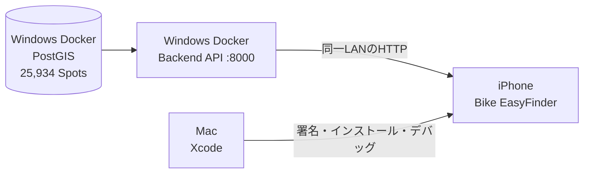

# iPhone実機でローカル収集データを確認する手順 v1

## 目次

<inline-toc preview="3"></inline-toc>

## 1. 結論

現在の収集済みデータをMacへコピーしなくても、iPhone実機でBike EasyFinderを動作確認できる。最短構成は次のとおりである。

1. Windows PCでDockerのDBとBackend APIを起動する。
2. Windows、Mac、iPhoneを同じローカルネットワークへ接続する。
3. Mac上のXcodeでAPI URLをWindows PCのLAN IPへ変更する。
4. Apple署名とローカルネットワーク権限を設定する。
5. MacへiPhoneを接続し、Xcodeから実機へインストールする。
6. iPhoneの現在地を使い、九州7県の公開済みCanonical Spotから推薦が返ることを確認する。

この構成では、データとAPIはWindowsに置いたまま、Macはビルド、iPhoneは実行だけを担当する。



## 2. この手順で確認できること

- 九州7県の公開済みCanonical Spot 25,934件をBackendの検索母集団として使用する。
- iPhoneの位置情報と、選択した利用可能時間から近隣候補を最大5件表示する。
- Spot詳細、保存、リアクション、Apple Mapsへの引き渡しを実機で確認する。
- ローカル環境では`ROUTE_PROVIDER=approximate`を使用するため、経路時間は概算である。

25,934件すべてをiPhoneへ一括ダウンロードする構成ではない。APIが現在地、時間、興味、公開状態、鮮度を使って候補を絞り込む。

## 3. 前提条件

### 3.1 Windows PC

- 本リポジトリと収集済みDocker volumeが存在する。
- Docker Desktopが起動している。
- Windows、Mac、iPhoneが相互通信できる同一LANに接続されている。
- LANをWindowsの「プライベートネットワーク」として使用する。

### 3.2 Mac

- リポジトリの`ios/BikeEasyFinder`を参照できる。
- XcodeとiOS 17以降のPlatform Supportがインストールされている。
- XcodeGenを使用できる。
- Xcodeの`Settings > Accounts`でApple Accountへサインインできる。

### 3.3 iPhone

- iOS 17以降である。
- Macを信頼し、Xcodeとペアリングできる。
- Developer Modeを有効にできる。
- Windows PCと同じLANへ接続できる。

Appleは、Xcodeから物理端末へ実行する場合、XcodeへのApple Account登録、Team割当、端末の登録、Development provisioning profileを必要としている。通常は`Automatically manage signing`を有効にするとXcodeが登録とprofile作成を行う。

## 4. 実行前の現行実装チェック

### 4.1 API URL

現行の`ios/BikeEasyFinder/project.yml`は次の値である。

```yaml
BIKE_API_BASE_URL: "http://127.0.0.1:8000"
```

`127.0.0.1`は、実機ではiPhone自身を表す。Windows PCのAPIには接続できないため、実機ビルドでは必ず次へ変更する。

```text
http://<Windows PCのLAN IPv4アドレス>:8000
```

### 4.2 ローカルネットワーク用途説明

現行`Info.plist`には`NSAllowsLocalNetworking=true`があるため、ローカル開発のHTTP通信を許可する構成になっている。一方、`NSLocalNetworkUsageDescription`は未記載である。

Appleは、ローカルホストへの直接unicast接続を含め、LANを使用するアプリへ`NSLocalNetworkUsageDescription`の記載を求めている。実機ビルド前に、`ios/BikeEasyFinder/BikeEasyFinder/Resources/Info.plist`へ次を追加する。

```xml
<key>NSLocalNetworkUsageDescription</key>
<string>同じネットワーク上のBike EasyFinder開発用APIに接続するために使用します。</string>
```

追加をリポジトリへ反映する場合は、実装変更としてCodexへ依頼する。手元だけで追加した場合も、`xcodegen generate`後の生成物ではなく、上記の元`Info.plist`を編集する。

### 4.3 Bundle IDとWeatherKit

現行Bundle IDは`com.bikeeasyfinder.app`、WeatherKit entitlementは有効である。Xcodeの署名エラーを避けるため、次を確認する。

- Bundle IDが選択したApple Developer Teamで利用可能か。
- `Automatically manage signing`が有効か。
- Teamが選択されているか。
- App IDでWeatherKit capabilityを利用できるか。

Bundle IDを変更する場合は、生成された`.xcodeproj`だけでなく`project.yml`を変更してから再生成する。

## 5. WindowsでDBとAPIを起動する

PowerShellでリポジトリルートへ移動する。

```powershell
Set-Location 'C:\Users\nakam\iCloudDrive\software_creation\bike_PJ\bike_easyfinder_pj'
```

DB、migration、Backend APIを起動する。

```powershell
docker compose up -d api
docker compose ps
```

`db`が`healthy`、`api`が`healthy`になったことを確認する。Windows自身からhealth checkを行う。

```powershell
Invoke-RestMethod http://localhost:8000/healthz
```

次の応答になればAPIは起動している。

```json
{"status":"ok"}
```

公開Spotの県別監査も実行する。

```powershell
docker compose run --rm api-migrate `
  bike-api audit-kyushu --minimum-spots-per-prefecture 1
```

7県すべてが`release_ready: true`であることを確認する。`1`はローカル疎通用の最低値であり、限定βの品質基準ではない。

## 6. WindowsのLAN IPを確認する

PowerShellで次を実行する。

```powershell
ipconfig
```

現在使用中のWi-FiまたはEthernetアダプターの`IPv4 Address`を確認する。例として`192.168.1.50`だった場合、実機用URLは次になる。

```text
http://192.168.1.50:8000
```

このIPアドレスはルーターの再接続で変わる場合がある。実機が突然接続できなくなった場合は、最初にIPアドレスを再確認する。

## 7. MacからAPIへ疎通確認する

MacをWindowsと同じLANへ接続し、Terminalで次を実行する。`192.168.1.50`は実際のWindows LAN IPへ置き換える。

```bash
curl --fail --show-error http://192.168.1.50:8000/healthz
```

次に、福岡市中心部を出発地とした推薦APIを直接確認する。

```bash
curl --fail --show-error \
  -X POST 'http://192.168.1.50:8000/v1/recommendations' \
  -H 'Content-Type: application/json' \
  -d '{
    "origin": {"latitude": 33.5902, "longitude": 130.4017},
    "available_minutes": 120,
    "interests": ["any"],
    "allow_highway": false
  }' | python3 -m json.tool
```

`candidates`に0〜5件が入り、候補に`spot_id`、`name`、`coordinate`があれば、収集済みCanonical SpotをBackendから利用できている。

### 7.1 Windows Firewallで遮断される場合

Windows自身では成功し、Macから失敗する場合だけ、Windows Defender FirewallでTCP 8000の受信をプライベートネットワークに限定して許可する。管理者PowerShellを使う場合の例は次のとおりである。

```powershell
New-NetFirewallRule `
  -DisplayName 'Bike EasyFinder local API 8000' `
  -Direction Inbound `
  -Protocol TCP `
  -LocalPort 8000 `
  -Action Allow `
  -Profile Private
```

テスト終了後に規則が不要なら、次で削除する。

```powershell
Remove-NetFirewallRule -DisplayName 'Bike EasyFinder local API 8000'
```

ポート8000をPublic profileやインターネットへ公開しない。ルーターのポート転送も設定しない。

## 8. MacでXcodeプロジェクトを生成する

Terminalでリポジトリ内のiOSフォルダへ移動する。

```bash
cd '<リポジトリのMac上のパス>/ios/BikeEasyFinder'
xcodebuild -version
xcodegen --version
xcodegen generate
open BikeEasyFinder.xcodeproj
```

`xcodegen`が見つからない場合は、XcodeGenをインストールしてから再実行する。Homebrewを利用しているMacでは次のコマンドを使用できる。

```bash
brew install xcodegen
```

## 9. Xcodeで実機用の設定を行う

### 9.1 API URL

Xcodeで`BikeEasyFinder` targetを選択し、`Build Settings`の`BIKE_API_BASE_URL`を検索する。Debugの値をWindowsのLAN URLへ変更する。

```text
http://192.168.1.50:8000
```

この値は秘密情報ではないが、端末ごとに異なるローカル設定である。LAN IPを共有branchへcommitしない。

`xcodegen generate`を再実行すると生成済みprojectの手動変更が失われる可能性がある。再生成後はAPI URLを再確認する。恒久的に管理する場合は、Debug専用のGit管理外`.xcconfig`を別タスクで導入する。

### 9.2 署名

1. Xcodeの`Settings > Accounts`でApple Accountへサインインする。
2. Project navigatorで`BikeEasyFinder` projectを選択する。
3. `BikeEasyFinder` targetの`Signing & Capabilities`を開く。
4. `Automatically manage signing`を有効にする。
5. `Team`を選択する。
6. Bundle Identifierの重複エラーがあれば、Team内で一意な値へ変更する。
7. WeatherKit capabilityにエラーがないことを確認する。

## 10. iPhoneをMacへ接続する

1. iPhoneをUSBでMacへ接続する。
2. iPhoneに「このコンピュータを信頼しますか」と表示されたら、内容を確認して信頼する。
3. XcodeのDevice Hubまたは実行先一覧でiPhoneを選択する。
4. XcodeがDeveloper Modeを要求した場合、iPhoneの`設定 > プライバシーとセキュリティ > デベロッパモード`を有効にする。
5. iPhoneの再起動後、Developer Modeの有効化を確認する。
6. Xcodeの実行先を接続したiPhoneにする。

Developer Modeは、XcodeからDevelopment署名したアプリを実行するために必要である。App StoreやTestFlightから通常インストールする利用者には不要である。

## 11. iPhone実機で実行する

Xcodeで`Product > Run`、またはRunボタンを押す。ビルドと署名が成功すると、XcodeがiPhoneへアプリをインストールして起動する。

初回起動時は次を許可する。

- ローカルネットワーク: 許可
- 位置情報: 「Appの使用中は許可」

アプリで次を実施する。

1. 利用可能時間を選ぶ。最初は120分以上を推奨する。
2. 興味は最初に「おまかせ」を選ぶ。
3. 高速道路は任意に設定する。
4. 検索を実行する。
5. 最大5件の候補が表示されることを確認する。
6. 詳細画面、保存、リアクションを確認する。
7. Apple Mapsを開き、表示された名称と座標を確認する。

WeatherKitの取得に失敗しても、推薦処理自体は継続する設計である。ローカル確認では、最初に推薦候補が表示されることを優先する。

## 12. 九州外から試す場合

現在の公開Spotは九州7県である。APIの検索半径は利用可能時間に応じて広がるが最大250kmであるため、iPhoneの実位置が九州から遠い場合は候補0件になる。これはデータ不良ではない。

九州外で動作確認するときは、次のいずれかを使う。

- XcodeのDebug用location simulationで福岡市付近を指定する。
- 福岡市付近の静的GPXをprojectへ追加し、Debug schemeのDefault Locationに選ぶ。
- 先に7章の`curl`で福岡市座標を指定し、APIとデータだけを確認する。

動作確認用の代表座標は次のとおりである。

```text
福岡市付近: latitude 33.5902, longitude 130.4017
```

本番配布ビルドではlocation simulationを使用しない。

## 13. 成功判定

次をすべて満たせば、収集済みデータを使ったiPhone実機動作確認は成功である。

- Windowsの`/healthz`が`{"status":"ok"}`を返す。
- MacからWindows LAN IPの`/healthz`へ接続できる。
- Macから`/v1/recommendations`を呼び、実在する候補が返る。
- Xcodeの署名が成功し、iPhoneへアプリをインストールできる。
- iPhoneでローカルネットワークと位置情報を許可できる。
- iPhoneアプリに最大5件の推薦候補が表示される。
- 候補名と座標をApple Mapsへ引き渡せる。

## 14. トラブルシューティング

### 14.1 iPhoneで「推薦サービスに接続できません」

- `BIKE_API_BASE_URL`が`127.0.0.1`のままではないか確認する。
- WindowsのLAN IPが変わっていないか確認する。
- iPhoneとWindowsが同じLANか確認する。
- Macから`curl http://<Windows IP>:8000/healthz`を実行する。
- Windows FirewallがPrivate profileのTCP 8000を許可しているか確認する。
- iPhoneの`設定 > プライバシーとセキュリティ > ローカルネットワーク`でアプリが許可されているか確認する。
- `NSLocalNetworkUsageDescription`がビルド後のInfo.plistへ入っているか確認する。

### 14.2 Macからhealth checkできない

- `docker compose ps`で`db`と`api`を確認する。
- Windows自身の`http://localhost:8000/healthz`が成功するか確認する。
- ゲストWi-FiやAP isolationで端末間通信が禁止されていないか確認する。
- VPNを一時的に外した状態で同一LAN疎通を確認する。

### 14.3 候補が0件

- 実機位置が九州から250km以上離れていないか確認する。
- 興味を「おまかせ」にする。
- 利用可能時間を120分以上へ変更する。
- `audit-kyushu`で7県が`release_ready`か確認する。
- Spotの`verified_at`が180日以内か確認する。最後の収集から180日を超えた場合はrefreshとpromotionを行う。

### 14.4 Signingエラー

- XcodeへApple Accountが登録されているか確認する。
- Teamと`Automatically manage signing`を確認する。
- Bundle IDをTeam内で一意にする。
- iPhoneの登録とDeveloper Modeを確認する。
- WeatherKit capabilityを利用できるApp IDか確認する。

### 14.5 ローカルネットワーク許可を誤って拒否した

iPhoneの`設定 > プライバシーとセキュリティ > ローカルネットワーク`でBike EasyFinderを許可する。項目がない、または挙動が変わらない場合は、`NSLocalNetworkUsageDescription`を確認してアプリを再インストールする。

## 15. 終了とセキュリティ

確認終了後、WindowsでAPIを停止する。

```powershell
docker compose stop api
```

DBも停止する場合は次を実行する。

```powershell
docker compose down
```

`docker compose down --volumes`は収集済みDBを削除するため実行しない。

ローカルAPIには利用者認証がないため、次を守る。

- LAN内の開発確認だけに使用する。
- Public network profileやルーターのポート転送で公開しない。
- TestFlight、外部テスター、携帯回線からの利用にはHTTPS staging APIを用意する。
- staging／productionでは`ROUTE_PROVIDER=apple`と短期token管理を含むrelease gateを別途完了する。

## 16. 関連文書と公式資料

- [Spotデータ収集機構 実装・収集結果](../ModifyHistory/spot-data-collection-implementation-result-v1.md)
- [MVP ローカル構築・Release Gate手順](./mvp-local-build-and-release-gates-v1.md)
- [MVP限定β公開に向けたユーザー実施事項](./mvp-user-required-actions-v1.md)
- [Apple: Running your app on simulated or physical devices](https://developer.apple.com/documentation/xcode/running-your-app-on-simulated-or-physical-devices)
- [Apple: Enabling Developer Mode on a device](https://developer.apple.com/documentation/xcode/enabling-developer-mode-on-a-device)
- [Apple: NSLocalNetworkUsageDescription](https://developer.apple.com/documentation/bundleresources/information-property-list/nslocalnetworkusagedescription)
