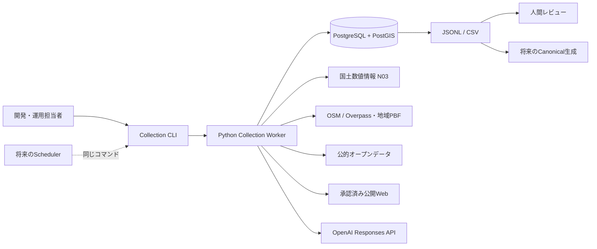
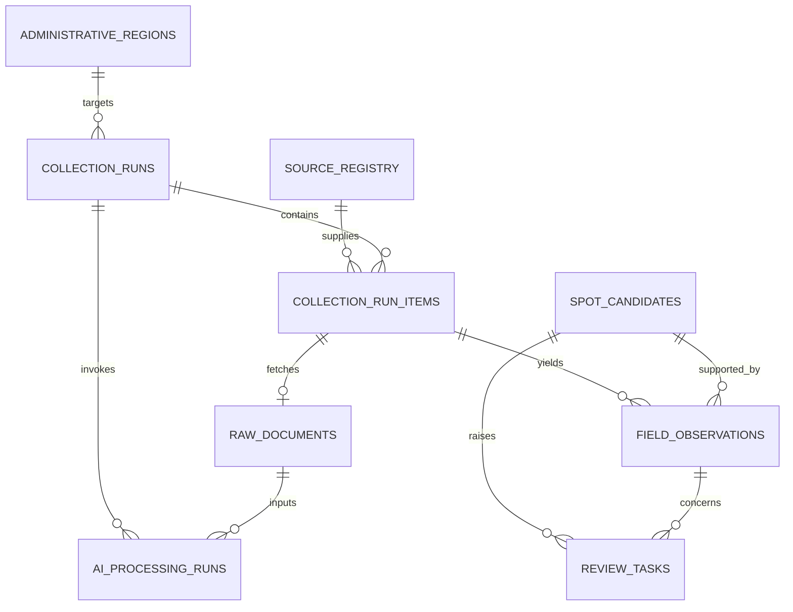
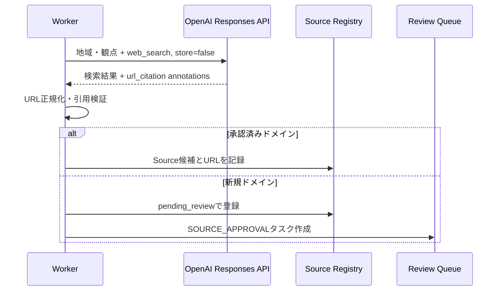
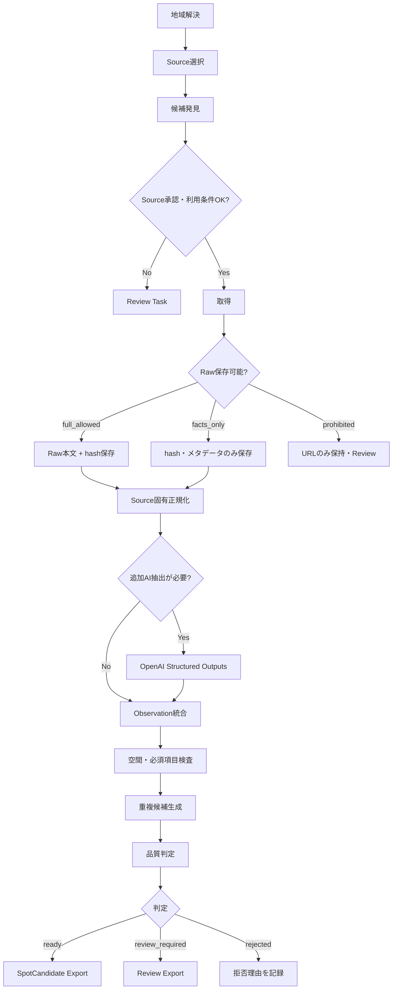

# Spotデータ収集機構 基本設計書 v1

## 目次

<inline-toc preview="3"></inline-toc>

## 1. 目的

`mvp-requirements-v1.md` のSpotデータ要件から、データの発見、取得、保存、正規化、品質検査だけを先行実装できる粒度へ落とし込む。

初回は福岡市を対象に約100件のSpot候補を収集して成立性を検証する。ただし、地域固有の処理を実装へ埋め込まず、行政区域コードを差し替えるだけで日本全国の都道府県、市区町村、政令指定都市、行政区を収集対象にできる構造とする。

## 2. ゴール

- Python Worker、PostgreSQL + PostGIS、Docker Composeでローカル収集環境を再現できる。
- 国土数値情報N03から全国の行政区域を同期し、コード指定で収集境界を解決できる。
- OSM、公的オープンデータ、OpenAIによるWeb候補発見、手動Seedを同一の収集パイプラインで処理できる。
- 全ての属性候補について出典、取得日時、確認日時、利用条件、保存可否、抽出方法、信頼度を追跡できる。
- 処理中断後の再開、再実行時の冪等性、Source単位の再試行が成立する。
- Canonical Spot生成側へ、出典付きの `SpotCandidate v1` をJSONLまたはCSVで引き渡せる。

初回検証の完了条件は、福岡市の出典付きSpot候補を約100件収集し、欠損率、重複候補率、AI抽出成功率、レビュー発生率、Source別処理時間と費用を計測できることである。100件は品質を下げて達成するノルマではない。

## 3. 対象範囲

### 3.1 対象

- 全国行政区域マスターの同期と検索
- Spot候補となる原情報の発見と取得
- Source台帳と利用条件判定
- Rawデータの保存可否判定と保存
- Source固有データの共通形式への正規化
- OpenAIを使った候補URL発見と属性抽出
- 空間検証、必須項目検査、重複候補生成
- 人間レビュー用タスク生成とCSV／JSONL出力
- 初回収集と月次差分更新

### 3.2 対象外

- 推薦、検索API、iOSアプリ
- ユーザー行動イベント
- OSM道路ネットワークとRouting用グラフ
- Canonical Spotの自動生成・公開
- Google Places、画像収集、UGC
- 人間レビュー用の管理画面
- クラウド基盤とクラウドスケジューラーの構築

本機構の最終出力は公開Spotではなく、出典と品質状態を伴う公開前のSpot候補である。

### 3.3 画像収集の後続設計

画像収集は初期版の対象外を維持し、表示はプレースホルダへフォールバックする。後続フェーズで実装する場合は、任意Webサイトの画像URLをそのまま保存・ホットリンクせず、Wikimedia Commons等の再利用条件と帰属を確認できるSourceだけを対象とする。

後続のCanonical境界では、Spot本体と分離した `spot_media` 相当の構造に、`spot_id`、自前オブジェクトストレージの保存URL、原典URL、ライセンス状態・名称・URL、帰属文、確認日時、代替テキスト、代表画像フラグを保持する。`license_status=verified` かつ画像保存・再配布を許可するSourceだけを公開候補とし、削除・利用条件変更をSourceから追跡できることを実装開始条件とする。

公開APIの `hero_image` は任意項目とし、iOSは画像欠損・通信失敗・採用取消時に同じプレースホルダへ戻る。画像バイナリ保存先、変換サイズ、費用上限、キャッシュ・削除SLA、帰属表示位置をADRで承認するまで収集を有効化しない。

## 4. 設計原則

1. **原情報優先:** taxonomyを先に固定せず、再分類可能な名称、説明、原分類語、特徴、立地、補足情報を保持する。
2. **Provenance必須:** 出典のない値を永続化された候補属性として扱わない。
3. **AIは補助:** AIは発見と抽出を補助するが、AIの推測だけで事実、利用条件、公開可否を確定しない。
4. **取得と公開を分離:** 取得できたことを、保存、転載、公開できることと同一視しない。
5. **全国共通:** 地域は行政区域コードとポリゴンで表現し、Sourceアダプターへ地域名を直書きしない。
6. **再実行可能:** 入力版、Source、プロンプト、モデル、処理結果を記録し、同じRunを再開・検証できるようにする。
7. **失敗を局所化:** 1つのSourceやAI呼び出しの失敗でRun全体を破棄しない。

## 5. システム構成

### 5.1 コンテキスト



### 5.2 ローカル構成

```text
Docker Compose
├─ db
│  └─ PostgreSQL + PostGIS
├─ worker
│  └─ Python CLI / collection modules
└─ optional object storage
   └─ 初期版は無効。許可されたRaw本文はDB圧縮列へ保存
```

`worker` はHTTPサーバを持たないバッチプロセスとする。将来クラウドへ移す場合もCLIの引数と終了コードを維持し、SchedulerはCLIを起動するだけとする。

### 5.3 Worker内部モジュール

```text
collection_worker
├─ cli                 コマンド解析、終了コード
├─ regions             N03同期、地域解決、境界生成
├─ sources             Source台帳、利用条件、取得ポリシー
├─ adapters
│  ├─ osm_overpass     小規模初回収集
│  ├─ osm_pbf          全国規模の反復収集への交換点
│  ├─ open_data        CSV / JSON / GeoJSON
│  ├─ openai_discovery OpenAI Web search
│  └─ manual_seed      URL / ファイルSeed
├─ fetch               HTTP、cache、robots、rate limit
├─ normalize           共通Observation生成
├─ ai                  OpenAI属性抽出
├─ quality             必須項目、空間、矛盾、重複検査
├─ review              Review Task生成
├─ export              SpotCandidate v1出力
└─ persistence         Repository、transaction、checkpoint
```

アダプターは共通して `discover`、`fetch`、`normalize`、`checkpoint` を実装する。地域解決、Raw保存、AI、品質判定、DB書込みをアダプターへ持ち込まない。

## 6. 行政区域設計

### 6.1 正本とコード

行政区域の初期正本には国土交通省「国土数値情報 行政区域データ N03」を使用する。N03の行政区域コード、都道府県名、市区町村名、行政界ポリゴンとデータ基準日を保存する。

- 都道府県指定は2桁コードを受け付け、その配下の行政区域ポリゴンを結合する。
- 市区町村・行政区指定はN03の5桁行政区域コードを正規形とする。
- 6桁の地方公共団体コードが入力された場合は検査数字を検証後に5桁へ正規化する。
- 政令指定都市全体は親コードを持つ論理地域として登録し、行政区ポリゴンを `ST_UnaryUnion` した境界を使用する。
- 行政区単体は各区のコードとポリゴンを使用する。
- 福岡市全体の初回対象は親地域 `40130`、区単位では `40131` などの子地域を使用する。

N03の版更新時は既存行を上書きせず、`dataset_version` と `valid_from` を持つ新しい版を登録する。収集Runは開始時に使用した行政区域版を固定する。

### 6.2 地域解決結果

地域解決サービスは次を返す。

```json
{
  "region_id": "uuid",
  "region_code": "40130",
  "region_kind": "designated_city",
  "name_ja": "福岡市",
  "prefecture_code": "40",
  "parent_region_code": "40",
  "geometry_version": "N03-20230101",
  "bbox": [130.20, 33.39, 130.50, 33.75],
  "geometry_ref": "administrative_regions.geometry"
}
```

緯度経度の例はインターフェース説明用であり、境界値はDBのN03ポリゴンを正とする。

### 6.3 利用条件

N03のSource台帳には、配布ページ、データ版、取得日、適用利用規約、出典表記、加工有無を登録する。エクスポートには「国土数値情報を加工して作成した境界で地域判定した」ことを継承する。N03はナビゲーション精度の保証には使わず、収集対象の範囲指定と地域判定に限定する。

参照:

- [国土数値情報 行政区域データ](https://nlftp.mlit.go.jp/ksj/gml/datalist/KsjTmplt-N03-v3_1.html)
- [国土数値情報 利用規約](https://nlftp.mlit.go.jp/ksj/other/agreement_02.html)

## 7. Source設計

### 7.1 Source種別

| `source_type` | 用途 | 初期実装 |
|---|---|---|
| `n03` | 行政区域 | 必須 |
| `osm_overpass` | 小規模なSpot候補発見・基本属性 | 必須 |
| `osm_pbf` | 大量・反復のOSM取得 | インターフェースのみ |
| `public_open_data` | 自治体等のCSV／JSON／GeoJSON | 必須 |
| `official_web` | 公式サイトの事実確認 | Manual Seedから開始 |
| `general_web` | 観光記事、施設紹介、地域メディア等の一般Web | Manual Seedまたは承認済みWeb取得から開始 |
| `openai_web_discovery` | 候補URL・追加Source発見 | 必須 |
| `manual_seed` | 担当者指定URL・ファイル。確認方法は別途記録 | 必須 |

`official_web` と `general_web` は区別して登録するが、Source種別だけでCanonical採用順位を固定しない。収集できるSourceと、個々の属性をCanonicalへ採用できるSourceは別判定とする。

### 7.2 Source承認状態

```text
pending_review → approved → suspended → retired
        └────────→ rejected
```

- OpenAIが新しく発見したドメインは必ず `pending_review` で登録する。
- `approved` だけを自動巡回できる。
- OSM、N03、承認済みオープンデータは初期設定で `approved` とする。
- 利用規約、robots、著作権、API条件、保存可否のいずれかが不明なSourceは `pending_review` のままとする。
- `suspended` は障害、規約変更、過負荷、品質問題による一時停止、`retired` は恒久停止に使用する。

### 7.3 保存ポリシー

`raw_storage_policy` は次のいずれかとする。

- `full_allowed`: Raw本文を保存可能。初期既定保持期間は最終処理成功から90日。
- `facts_only`: 本文を保存せず、URL、hash、HTTPメタデータ、短い事実メモ、構造化Observationのみ保存。
- `metadata_only`: URL、取得結果、hash、引用情報のみ保存。属性抽出には使用しない。
- `prohibited`: 自動取得も保存もしない。人間がブラウザで確認するためのURLだけ保持。

Source固有の規約が既定より厳しい場合はSource設定を優先する。削除後も、URL、取得日時、content hash、削除理由、Source版は監査情報として保持する。

### 7.4 OSM取得方式

初回の福岡市検証では公開Overpass APIを使用できる。ただし次を強制する。

- 1プロセス1リクエストの直列実行
- アプリ名と連絡先を含むUser-Agent
- 応答cacheと同一query hashの再利用
- `429`、`503`、timeout時の指数バックオフと `Retry-After` 尊重
- 1Run当たりの問い合わせ回数と取得量上限
- node、way、relationを共通のOSM原典IDへ正規化

公開Overpassは全国の大量・定期取得基盤にはしない。対象が県単位または定期Runで取得上限を超える場合は、地域PBFを取得し、N03境界でローカル抽出する `osm_pbf` アダプターへ切り替える。切替後もObservationとSource契約は変えない。

参照:

- [OpenStreetMap Copyright and License](https://www.openstreetmap.org/copyright)
- [Overpass API](https://wiki.openstreetmap.org/wiki/Overpass_API)

### 7.5 OSM対象タグ

初期クエリはSpot候補の発見を目的とし、道路networkは取得しない。対象キーは設定ファイルで版管理し、初期値は次の系統とする。

- `tourism=*`
- `amenity=cafe|restaurant|public_bath|parking`
- `leisure=park|nature_reserve`
- `natural=peak|beach|hot_spring|cliff`
- `historic=*`
- `place=locality`
- `information=guidepost|board|map` は単体Spot候補から除外

タグは候補発見条件であり、Canonical taxonomyではない。OSMタグ全体を `source_payload` またはObservationとして保持する。

## 8. CLIインターフェース

### 8.1 コマンド

```bash
# 全国行政区域を同期
python -m collection_worker regions sync --dataset-version latest

# 福岡市を全Sourceで初回収集
python -m collection_worker collect \
  --region-code 40130 \
  --sources osm_overpass,public_open_data,openai_web_discovery,manual_seed \
  --mode initial

# 福岡県全体を更新
python -m collection_worker collect \
  --prefecture-code 40 \
  --sources osm_pbf,public_open_data,openai_web_discovery \
  --mode refresh

# 失敗項目から再開
python -m collection_worker runs resume <run_id> --failed-only

# Canonical生成工程へ引き渡す
python -m collection_worker export \
  --run-id <run_id> \
  --format jsonl \
  --status ready,review_required
```

### 8.2 引数規則

- `--region-code` と `--prefecture-code` は排他的かつどちらか必須。
- `--sources` はSource台帳の論理名をカンマ区切りで指定する。
- `--mode initial` は対象Sourceの全件取得、`refresh` は期限切れ・変更候補だけを取得する。
- `--dry-run` は地域解決、Source選択、予定件数、費用見積りだけを行い、外部取得とDB更新をしない。
- `--limit` は検証用の候補上限であり、Source側APIのpage sizeとは分離する。
- `--checkpoint-every` の初期値は100項目とする。

### 8.3 終了コード

| Code | 意味 |
|---:|---|
| `0` | 全対象Sourceが完了 |
| `2` | 一部失敗。Runは `partial` で再開可能 |
| `3` | 入力・設定・地域コード不正 |
| `4` | 利用条件または予算ゲートで開始拒否 |
| `5` | DB・行政区域等の必須基盤障害 |

## 9. データ設計

### 9.1 エンティティ関係



### 9.2 `administrative_regions`

| 列 | 型 | 制約・意味 |
|---|---|---|
| `id` | UUID | PK |
| `region_code` | VARCHAR(5) | 行政区域版内で一意 |
| `region_kind` | VARCHAR | `prefecture / municipality / designated_city / ward` |
| `name_ja` | TEXT | 必須 |
| `prefecture_code` | CHAR(2) | 必須 |
| `parent_region_code` | VARCHAR(5) | nullable |
| `geometry` | GEOMETRY(MultiPolygon, 4326) | 必須、GIST index |
| `dataset_version` | TEXT | 必須 |
| `valid_from` | DATE | 必須 |
| `source_registry_id` | UUID | FK、必須 |
| `is_current` | BOOLEAN | 版ごとに管理 |

一意制約は `(region_code, dataset_version)`。都道府県と政令指定都市の論理境界も同じ表に格納し、`region_kind` で区別する。

### 9.3 `source_registry`

| 列 | 型 | 制約・意味 |
|---|---|---|
| `id` | UUID | PK |
| `source_key` | TEXT | 一意な論理名 |
| `source_type` | TEXT | 7.1の列挙 |
| `base_url` | TEXT | nullable |
| `domain` | TEXT | Web Sourceの場合必須 |
| `approval_status` | TEXT | 7.2の状態 |
| `license_status` | TEXT | `verified / restricted / unknown / prohibited` |
| `license_name` | TEXT | nullable |
| `terms_url` | TEXT | nullable |
| `attribution_text` | TEXT | nullable |
| `robots_checked_at` | TIMESTAMPTZ | nullable |
| `raw_storage_policy` | TEXT | 7.3の列挙 |
| `refresh_interval_days` | INTEGER | nullable |
| `rate_limit_per_minute` | INTEGER | 必須 |
| `request_timeout_seconds` | INTEGER | 必須 |
| `max_pages_per_run` | INTEGER | 必須 |
| `config` | JSONB | parser、query、header等。秘密情報は禁止 |
| `reviewed_by` / `reviewed_at` | TEXT / TIMESTAMPTZ | 承認監査 |

Source配下の各取得レコードは `collection_run_items` と `field_observations` により、URL、取得日時、Source種別、確認状態、原典IDを追跡する。Source台帳の承認は自動取得の可否であり、全属性のCanonical採用を一括承認するものではない。

### 9.4 `collection_runs`

| 列 | 型 | 制約・意味 |
|---|---|---|
| `id` | UUID | PK、Run ID |
| `region_id` | UUID | FK、必須 |
| `region_dataset_version` | TEXT | 開始時に固定 |
| `mode` | TEXT | `initial / refresh` |
| `status` | TEXT | Run状態 |
| `requested_sources` | JSONB | 順序付きSource key |
| `config_snapshot` | JSONB | 秘密を除く実効設定 |
| `started_at` / `finished_at` | TIMESTAMPTZ | nullable |
| `checkpoint` | JSONB | Source別cursorと最終item |
| `metrics` | JSONB | 件数、欠損、重複、時間、AI使用量 |
| `error_summary` | JSONB | エラーコード別件数 |

Run状態は次のとおりとする。

```text
queued → running → completed
              ├─→ partial → running
              ├─→ failed
              └─→ cancelled
```

`partial` は1つ以上のSourceまたは項目が失敗したが、結果とcheckpointを利用できる状態である。`failed` はDB障害や地域解決失敗など、Runが有効な成果を残せなかった状態とする。

### 9.5 `collection_run_items`

| 列 | 型 | 制約・意味 |
|---|---|---|
| `id` | UUID | PK |
| `run_id` | UUID | FK、必須 |
| `source_registry_id` | UUID | FK、必須 |
| `source_record_id` | TEXT | 原典内ID。URLのみの場合はcanonical URL hash |
| `item_key` | TEXT | 冪等キー |
| `status` | TEXT | item状態 |
| `source_url` | TEXT | 必須 |
| `discovered_at` / `fetched_at` | TIMESTAMPTZ | nullable |
| `attempt_count` | INTEGER | 初期値0 |
| `next_retry_at` | TIMESTAMPTZ | nullable |
| `http_status` | INTEGER | nullable |
| `error_code` / `error_detail` | TEXT | detailは秘匿済み短文 |

`item_key` は `SHA-256(region_id + source_type + source_record_id)` とし、`(run_id, item_key)` を一意にする。同じ原典レコードのRun横断識別には `source_registry_id + source_record_id` を使用する。

item状態は次のとおりとする。

```text
discovered → fetched → normalized → ready
     │          │           ├─→ review_required
     │          │           └─→ rejected
     └──────────┴──────────────→ rejected
```

一時的障害は状態を進めず `next_retry_at` を設定する。再試行上限到達後は、部分成果があれば `review_required`、なければ `rejected` とする。

### 9.6 `raw_documents`

| 列 | 型 | 制約・意味 |
|---|---|---|
| `id` | UUID | PK |
| `run_item_id` | UUID | FK、一意 |
| `canonical_url` | TEXT | 必須 |
| `content_type` | TEXT | 必須 |
| `content_hash` | CHAR(64) | 必須 |
| `body_compressed` | BYTEA | `full_allowed` のみ |
| `body_encoding` | TEXT | nullable |
| `response_headers` | JSONB | Cookie、認証値を除外 |
| `retrieved_at` | TIMESTAMPTZ | 必須 |
| `storage_policy` | TEXT | 取得時の判定を固定 |
| `expires_at` | TIMESTAMPTZ | nullable |
| `deleted_at` / `deletion_reason` | TIMESTAMPTZ / TEXT | 論理削除監査 |

`facts_only` 以下では `body_compressed` を常にNULLとする。アプリケーションとDBの両方でCHECK制約を設ける。

### 9.7 `spot_candidates`

| 列 | 型 | 制約・意味 |
|---|---|---|
| `id` | UUID | PK |
| `region_id` | UUID | FK、必須 |
| `status` | TEXT | `draft / ready / review_required / rejected / superseded` |
| `display_name` | TEXT | nullable、Observationから選んだ表示候補 |
| `location` | GEOGRAPHY(Point, 4326) | nullable、GIST index |
| `address_text` | TEXT | nullable |
| `normalized_name` | TEXT | 重複候補生成用 |
| `source_count` | INTEGER | 0禁止 |
| `quality_score` | NUMERIC(5,2) | 0〜100、公開可否とは別 |
| `created_at` / `updated_at` | TIMESTAMPTZ | 必須 |

候補は名称と位置のどちらかだけでも `draft` として保持できるが、`ready` には名称と、座標または位置特定可能な住所が必要である。

### 9.8 `field_observations`

Canonical候補の各属性値と出典を分離して保持する。

| 列 | 型 | 制約・意味 |
|---|---|---|
| `id` | UUID | PK |
| `candidate_id` | UUID | FK、必須 |
| `run_item_id` | UUID | FK、必須 |
| `field_name` | TEXT | 例 `name`, `location`, `opening_hours` |
| `value` | JSONB | 原型を保てる値 |
| `raw_label` | TEXT | 原分類語等、nullable |
| `extraction_method` | TEXT | `source_native / rule / openai / manual` |
| `confidence` | NUMERIC(4,3) | 0〜1 |
| `source_url` | TEXT | 必須 |
| `source_record_id` | TEXT | 必須 |
| `observed_at` | TIMESTAMPTZ | 原典時刻、nullable |
| `retrieved_at` | TIMESTAMPTZ | 必須 |
| `verified_at` | TIMESTAMPTZ | nullable |
| `license_status` | TEXT | 取得時の判定を固定 |
| `evidence_excerpt` | TEXT | 保存許可された短い根拠のみ |

AI抽出値は `extraction_method=openai` とし、引用元の `run_item_id` がないObservationをDB制約で拒否する。

### 9.9 `ai_processing_runs`

| 列 | 型 | 制約・意味 |
|---|---|---|
| `id` | UUID | PK |
| `collection_run_id` | UUID | FK、必須 |
| `raw_document_id` | UUID | 属性抽出時必須、発見時nullable |
| `purpose` | TEXT | `source_discovery / observation_extraction` |
| `provider` | TEXT | `openai` 固定 |
| `model` | TEXT | 実際に応答したmodel ID |
| `prompt_version` | TEXT | 必須 |
| `response_id` | TEXT | nullable |
| `status` | TEXT | `queued / completed / refused / incomplete / invalid / failed` |
| `input_hash` | CHAR(64) | 本文自体は重複保存しない |
| `input_tokens` / `output_tokens` | INTEGER | nullable |
| `web_search_calls` | INTEGER | 初期値0 |
| `estimated_cost_jpy` | NUMERIC | nullable |
| `error_code` | TEXT | nullable |
| `created_at` / `completed_at` | TIMESTAMPTZ | 必須／nullable |

### 9.10 `review_tasks`

| 列 | 型 | 制約・意味 |
|---|---|---|
| `id` | UUID | PK |
| `candidate_id` | UUID | FK、必須 |
| `observation_id` | UUID | FK、nullable |
| `reason_code` | TEXT | レビュー理由 |
| `severity` | TEXT | `low / medium / high / blocking` |
| `old_value` / `proposed_value` | JSONB | nullable |
| `evidence` | JSONB | Source URL、差分、推奨判断 |
| `status` | TEXT | `open / approved / rejected / deferred / resolved` |
| `due_at` | TIMESTAMPTZ | nullable |
| `reviewed_by` / `reviewed_at` | TEXT / TIMESTAMPTZ | nullable |
| `decision_note` | TEXT | nullable |

`reason_code` は少なくとも `LICENSE_UNKNOWN`、`LOCATION_MISSING`、`OUTSIDE_REGION`、`SOURCE_CONFLICT`、`DUPLICATE_SUSPECTED`、`AI_ONLY_EVIDENCE`、`AI_EXTRACTION_FAILED`、`CLOSED_OR_UNAVAILABLE` を持つ。

## 10. OpenAI連携

### 10.1 共通方針

- OpenAI Responses APIを使用する。
- APIキーは `OPENAI_API_KEY` から読み、DB、設定snapshot、ログへ保存しない。
- `store=false` を全リクエストで明示する。
- OpenAIへ送るデータは公開Web本文、Sourceメタデータ、地域名・コードに限定する。
- モデル、プロンプト、JSON Schemaは設定と版を持たせる。
- OpenAIが返した文章自体をSourceにせず、必ず引用URLまたは入力文書へ結び付ける。
- retry対象はtimeout、429、5xxだけとし、refusalとSchema不適合を無制限に再送しない。

初期モデルは次のとおりとし、環境変数で差し替え可能にする。

```text
OPENAI_DISCOVERY_MODEL=gpt-6-astra
OPENAI_EXTRACTION_MODEL=gpt-6-luna
OPENAI_REQUEST_TIMEOUT_SECONDS=120
OPENAI_MAX_RETRIES=3
OPENAI_RUN_BUDGET_JPY=500
OPENAI_MONTHLY_BUDGET_JPY=3000
```

候補発見にはBrowsing能力を優先し、定型抽出には大量反復に適したモデルを使用する。model IDはコードへ散在させず、設定層だけで管理する。モデルを変更する場合は福岡市の固定評価セットで精度・費用を比較してから既定値を更新する。

参照:

- [GPT-6モデル選択](https://developers.openai.com/api/docs/guides/latest-model.md)
- [Responses APIのWeb search](https://developers.openai.com/api/docs/guides/tools-web-search)
- [Structured Outputs](https://developers.openai.com/api/docs/guides/structured-outputs)

### 10.2 Source Discovery

地域名、都道府県名、検索観点を入力し、Responses APIの `web_search` を使う。検索観点は設定ファイルで版管理し、初期値を「景勝地、海岸、山、温泉、カフェ、飲食、道の駅、史跡、観光施設、二輪駐車」とする。

出力から `url_citation` annotationのURLとtitleを抽出し、引用のない候補は破棄する。URLをcanonicalizeし、同一ドメイン・同一URLを重複登録しない。新規ドメインは `source_registry.approval_status=pending_review` とし、この段階では自動fetchしない。



### 10.3 属性抽出

Sourceの保存・処理条件を満たすRaw本文だけを入力し、Structured Outputsで `SpotObservation v1` を取得する。プロンプトには次を明記する。

- 入力文に明示された事実だけを抽出する。
- 不明値は推測せず `null` にする。
- 住所、座標、営業時間、駐車場、二輪可否、営業状態を混同しない。
- 原分類語と抽出特徴を原文の意味を変えず分離する。
- 各値に根拠となる短い引用位置または根拠ラベルを返す。
- 1ページに複数Spotがある場合は配列で分離する。

`SpotObservation v1` の論理Schemaは次のとおりとする。Structured Outputs向けには全プロパティをrequiredにし、不明値を `null` で表現する。

```json
{
  "$id": "https://bike-easyfinder.example/schemas/spot-observation-v1.json",
  "type": "object",
  "additionalProperties": false,
  "required": ["spots"],
  "properties": {
    "spots": {
      "type": "array",
      "items": {
        "type": "object",
        "additionalProperties": false,
        "required": [
          "name", "name_reading", "address", "latitude", "longitude",
          "description_facts", "source_categories", "features",
          "opening_hours_text", "business_status", "parking",
          "motorcycle_access", "road_access", "suggested_stay_minutes",
          "official_url", "evidence"
        ],
        "properties": {
          "name": { "type": ["string", "null"] },
          "name_reading": { "type": ["string", "null"] },
          "address": { "type": ["string", "null"] },
          "latitude": { "type": ["number", "null"], "minimum": -90, "maximum": 90 },
          "longitude": { "type": ["number", "null"], "minimum": -180, "maximum": 180 },
          "description_facts": { "type": "array", "items": { "type": "string" } },
          "source_categories": { "type": "array", "items": { "type": "string" } },
          "features": { "type": "array", "items": { "type": "string" } },
          "opening_hours_text": { "type": ["string", "null"] },
          "business_status": {
            "type": "string",
            "enum": ["open", "temporarily_closed", "permanently_closed", "unknown"]
          },
          "parking": { "type": "string", "enum": ["available", "unavailable", "unknown"] },
          "motorcycle_access": { "type": "string", "enum": ["allowed", "not_allowed", "unknown"] },
          "road_access": { "type": "string", "enum": ["accessible", "restricted", "unknown"] },
          "suggested_stay_minutes": { "type": ["integer", "null"], "minimum": 0 },
          "official_url": { "type": ["string", "null"] },
          "evidence": {
            "type": "array",
            "items": {
              "type": "object",
              "additionalProperties": false,
              "required": ["field", "excerpt"],
              "properties": {
                "field": { "type": "string" },
                "excerpt": { "type": "string" }
              }
            }
          }
        }
      }
    }
  }
}
```

API出力がrefusal、incomplete、Schema不適合、根拠なしのいずれかの場合、自動修復プロンプトによる再試行は1回だけ行う。再度失敗した場合は `AI_EXTRACTION_FAILED` のReview Taskを作り、元のrule-based Observationは保持する。

### 10.4 費用制御

- Run開始時に最大Web検索回数、入力文字数、想定token、概算費用を予約する。
- 1Run 500円を初期上限とし、上限到達時は新規AI処理を停止してRunを `partial` にする。
- 月3,000円を収集機構の初期上限とする。70%で警告、90%でSource Discoveryを停止、100%で全AI処理を停止する。
- モデルtokenとWeb検索回数を分けて記録する。
- retry分も同じ予算へ計上する。
- 予算値は環境設定で変更できるが、上限なしは許可しない。

## 11. 処理フロー

### 11.1 全体フロー



### 11.2 Run開始

1. CLI引数を検証する。
2. 現行行政区域版から対象ポリゴンを解決する。
3. 指定Sourceが存在し、対象地域に対応し、実行可能な承認状態か検査する。
4. 利用条件、リクエスト上限、AI予算を検査する。
5. 実効設定を秘密除外後にsnapshot化する。
6. `collection_runs` を `queued` で作成し、Worker獲得後に `running` へ遷移する。

### 11.3 発見と取得

- Source Adapterは発見結果を逐次 `collection_run_items` へupsertする。
- HTTP取得は条件付きGET、cache、ETag、Last-Modifiedを使用可能な範囲で利用する。
- redirect後URLをcanonical URLとし、追跡用query parameterを除去する。
- Content-Type、最大応答サイズ、文字コードを取得前後に検査する。
- HTML内リンクを無制限に辿らず、Source設定の許可pathと最大page数に制限する。
- robotsの拒否、ログイン要求、CAPTCHA、規約で自動取得不可の場合は迂回しない。

### 11.4 正規化

- SourceネイティブのIDと全タグ・列を失わずにObservationへ変換する。
- `name` の正規化ではUnicode NFKC、前後空白、連続空白、一般的な記号差だけを吸収する。
- 法人格、地名、施設種別を安易に除去しない。
- 座標はWGS84へ変換し、DBではPostGIS位置型を正とする。
- 住所から座標を推測する処理は別Observationとし、原典座標と混在させない。
- `unknown` と `false` を区別する。
- 営業時間、駐車場、二輪可否、通行可否は別々のObservationにする。

### 11.5 空間検査

- `ST_Covers(region.geometry, candidate.location)` を満たす座標は地域内とする。
- 境界外500m以内は境界・座標精度の可能性があるため `OUTSIDE_REGION` のReview Taskを作る。
- 境界外500m超は当該Runの候補として `rejected` にするが、原Observationは監査用に保持する。
- 都道府県収集では都道府県論理境界、政令指定都市収集では行政区を結合した論理境界を用いる。

### 11.6 重複候補

同一地域内で次を満たす組を重複候補とする。

```text
distance <= 100m
AND normalized_name_similarity >= 0.8
```

名称類似度には日本語対応のtrigram類似度を使用する。初期版は自動統合せず、双方へ `DUPLICATE_SUSPECTED` のReview Taskを作る。原典IDが完全一致する再取得は重複候補ではなく同一Sourceレコードの更新として扱う。

### 11.7 品質判定

`ready` には次を全て必要とする。

- 名称がある。
- 座標、または位置を特定可能な住所がある。
- 1件以上のSourceがある。
- 利用条件が `verified` または明示的に利用可能と判定されている。
- 全ての出力属性が1件以上のObservationを参照する。
- blocking Review Taskがない。
- 地域外、閉業・利用不可の重大疑義がない。

品質スコアはデータ分析用であり、`ready` 判定の代替にしない。初期スコアは必須項目充足35、Source信頼度25、Freshness20、複数Source一致10、位置精度10の合計100とする。

### 11.8 Canonical引き渡しと属性別採用

- Canonical SpotとSource／Observationを別エンティティとして保持する。
- Canonicalの名称、座標、営業時間、営業状態、駐車場、二輪可否等は、属性ごとに採用Observationを参照する。
- 採用記録にはSource、Observation、採用日時、採用理由、ルール版、手動判断時の確認者を保持する。
- 採用判定は属性への権威性、確認状態、確認日時、複数Source一致、抽出確度、利用条件を使い、固定のSource全体順位だけでは決めない。
- 矛盾を自動解決できない場合は既存Canonical値を維持し、属性単位の `SOURCE_CONFLICT` Review Taskを作る。

## 12. `SpotCandidate v1` 出力契約

### 12.1 JSONL

1行1候補とし、UTF-8、RFC 3339日時、WGS84座標を使用する。

```json
{
  "schema_version": "spot-candidate-v1",
  "candidate_id": "00000000-0000-0000-0000-000000000000",
  "region": {
    "code": "40130",
    "name": "福岡市",
    "dataset_version": "N03-20230101"
  },
  "status": "ready",
  "name": "候補名",
  "location": {
    "latitude": 33.0,
    "longitude": 130.0,
    "address": null
  },
  "source_categories": ["tourism=attraction"],
  "features": ["海岸"],
  "attributes": {
    "opening_hours_text": null,
    "business_status": "unknown",
    "parking": "unknown",
    "motorcycle_access": "unknown",
    "road_access": "unknown",
    "suggested_stay_minutes": null
  },
  "observations": [
    {
      "observation_id": "00000000-0000-0000-0000-000000000000",
      "field": "name",
      "value": "候補名",
      "source_type": "osm_overpass",
      "source_record_id": "node/123",
      "source_url": "https://www.openstreetmap.org/node/123",
      "retrieved_at": "2026-09-23T00:00:00Z",
      "verified_at": null,
      "license_status": "verified",
      "extraction_method": "source_native",
      "confidence": 0.9
    }
  ],
  "quality": {
    "score": 72.0,
    "review_reasons": []
  },
  "attributions": ["© OpenStreetMap contributors"],
  "generated_at": "2026-09-23T00:00:00Z"
}
```

正式なJSON Schemaファイルは実装時に本例から生成し、`schema_version` を固定する。破壊的変更は `spot-candidate-v2` とし、同一versionの意味を変更しない。

### 12.2 CSV

CSVは人間レビュー用途とし、複数Observationは別ファイルへ分離する。

- `candidates.csv`: 候補本体、地域、位置、品質、レビュー理由
- `observations.csv`: candidate ID、field、value JSON、Source、時刻、信頼度
- `attributions.csv`: candidate ID、Source、attribution、license URL

本文、API応答、秘密情報はエクスポートしない。

## 13. 冪等性、再試行、再開

全Canonical Spotおよび有効な全Sourceは月1回チェックする。チェック周期はジョブ実行間隔、Freshnessは属性値を古いと判断する期限であり、別に管理する。月次チェックに失敗してもFreshness期限内の確認済み値は維持し、失敗理由と再試行予定を記録する。期限超過後の警告・不明化・非公開は属性別ポリシーに従い、自動取得不能な項目はReview Taskへ送る。天気・経路等のリアルタイム情報はこの月次ジョブに含めない。

### 13.1 冪等性

- 発見項目は `region + source + source_record_id` から安定したkeyを作る。
- DB書込みはupsertし、再実行でSpot候補を増殖させない。
- 同じcontent hashのRaw本文は再抽出せず、既存Observationを新Runへ関連付ける。
- プロンプト版、Schema版、モデルのいずれかが変わった場合だけAI再抽出対象にできる。
- Sourceから削除されたレコードは即物理削除せず、`not_seen_since` を更新して差分レビューへ送る。

### 13.2 retry

| 障害 | retry |
|---|---|
| HTTP 429 | `Retry-After`、なければ指数バックオフ |
| HTTP 408 / 5xx / timeout | 最大3回、jitter付き指数バックオフ |
| HTTP 401 / 403 / 404 | 自動retryなし、Sourceまたはitemレビュー |
| robots拒否 / CAPTCHA | 自動retry・迂回なし |
| OpenAI refusal | 修復retryなし、review |
| OpenAI invalid/incomplete | 入力を変えず1回だけ再要求 |
| DB一時障害 | transaction rollback後に最大3回 |

バックオフ初期値は2秒、上限60秒、jitterは0〜1秒とする。公開Overpassはその利用方針と `Retry-After` を優先する。

### 13.3 resume

checkpointはSourceごとにcursor、page、最後に確定した `item_key`、更新時刻を保持する。`runs resume --failed-only` は `rejected` 以外の一時失敗項目と未完了Sourceだけを再開する。開始済みRunと異なる地域版、Source設定版、Schema版ではresumeせず、新Runを作成する。

## 14. ログ、監視、費用

### 14.1 構造化ログ

JSON Linesで次を記録する。

```text
timestamp, severity, event_name, run_id, region_code,
source_key, run_item_id, duration_ms, result_count,
error_code, retry_count, openai_model, input_tokens,
output_tokens, web_search_calls, estimated_cost_jpy
```

APIキー、Authorization header、Cookie、Raw本文、AIへの全文入力、個人情報らしき値はログへ出力しない。URLのqueryに秘密が含まれるSourceはqueryを除去して記録する。

### 14.2 Run metrics

- Source別発見・取得・正規化・ready・review・reject件数
- 名称、位置、住所、営業時間、駐車場、二輪可否の欠損率
- 地域外率、重複候補率、Source間矛盾率
- AI呼び出し成功、refusal、invalid、根拠不足率
- 1候補当たりのtoken、Web検索回数、概算費用
- Source別p50/p95処理時間とretry率
- Open Review Task数と最古滞留時間

## 15. セキュリティとデータ管理

- `.env` はlocal専用でGit管理しない。
- OpenAI、Source API、DBの資格情報を用途別に分離する。
- DBロールはmigration、worker、read-only reviewに分ける。
- Raw本文へのアクセスはworkerと明示的な運用担当者だけに制限する。
- HTTP取得は許可したscheme、domain、portに限定し、private IPとlink-localへの接続を拒否してSSRFを防ぐ。
- redirectごとに接続先を再検査する。
- XML、ZIP、CSVは展開後サイズ、ファイル数、path traversalを検査する。
- AIが返すURLを直接fetchせず、URL検証とSource承認を通す。
- Source停止・削除要求時は新規取得を停止し、該当Raw本文を論理削除し、依存ObservationとCandidateを再評価する。

## 16. 設定

秘密を含まないSource設定はYAMLで版管理し、環境差分と秘密は環境変数で与える。

```yaml
collection:
  checkpoint_every: 100
  raw_retention_days: 90
  outside_region_review_meters: 500
  duplicate_distance_meters: 100
  duplicate_name_similarity: 0.8

openai:
  discovery_model: gpt-6-astra
  extraction_model: gpt-6-luna
  store: false
  request_timeout_seconds: 120
  max_retries: 3
  run_budget_jpy: 500
  monthly_budget_jpy: 3000

sources:
  osm_overpass:
    approval_status: approved
    raw_storage_policy: full_allowed
    rate_limit_per_minute: 1
    request_timeout_seconds: 180
    max_pages_per_run: 20
```

起動時にSchema検証し、未知キー、上限なし、`openai.store=true`、承認前Sourceの自動fetchを設定エラーとして拒否する。

## 17. 試験設計

### 17.1 単体試験

- 2桁・5桁・検査数字付き6桁コードの正規化と不正値拒否
- 都道府県、通常市町村、政令市、行政区の境界解決
- URL canonicalize、domain検査、SSRF拒否
- 保存ポリシーごとのRaw本文保存有無
- Sourceネイティブ値からObservationへの変換
- `unknown` と `false` の保持
- 名称正規化、100m境界、類似度0.8境界
- Run/item状態の許可・禁止遷移
- SpotObservationとSpotCandidateのSchema検証
- OpenAI citation欠落、refusal、incomplete、invalid処理

### 17.2 結合試験

- N03テストfixtureから福岡市全体と区単位を解決する。
- 固定Overpass応答からnode、way、relationを正規化する。
- CSV、JSON、GeoJSONの公的データfixtureを同じObservationへ変換する。
- OpenAIの録画fixtureからcitationを保存し、新規ドメインを `pending_review` にする。
- Structured Outputsの正常・null・複数Spot・refusal fixtureを処理する。
- 同一Run再実行と別Run再取得で候補が重複しない。
- Source削除時に依存候補が再評価される。

### 17.3 障害試験

- HTTP 429、503、timeout、途中切断
- 不正JSON、文字化け、巨大response、ZIP bomb、壊れたGeoJSON
- OpenAI timeout、429、refusal、Schema不適合、予算超過
- DB transaction失敗、Worker強制終了、checkpointからの再開
- Source利用条件不明、robots拒否、redirect先domain不許可

### 17.4 全国対応回帰

少なくとも次をfixtureで検証する。

- 福岡市全体と福岡市内の行政区
- 九州内の通常市町村
- 九州外の政令指定都市と行政区
- 都道府県全体
- 離島を含むMultiPolygon地域
- 市町村合併・行政区域版変更

## 18. 受入条件

1. `40130` を指定し、出典付きSpot候補を品質を満たす範囲で約100件収集できる。
2. 福岡市以外の市区町村と都道府県でも、設定とコード指定だけで同じ処理を実行できる。
3. 政令指定都市全体と行政区単体を別々に指定できる。
4. 同一条件の再実行で候補数が不正に増えず、取得履歴とFreshnessだけが更新される。
5. 全候補に地域、名称、座標または住所、Source、取得日時、ライセンス状態がある。
6. OpenAI発見候補の100%が引用URLを持ち、引用のない候補は保存されない。
7. OpenAI抽出値の100%が入力文書のSourceとObservationを参照する。
8. 地域外、利用条件不明、AI失敗、Source矛盾、重複疑いがReview Taskになる。
9. 429、timeout、ネットワーク中断、Worker停止からcheckpointで再開できる。
10. 本文保存不可Sourceの本文がDB、ログ、エクスポートに残らない。
11. OSMと公的データの帰属・ライセンス情報が出力へ継承される。
12. 福岡市初回Runについて欠損率、重複候補率、レビュー率、AI成功率、Source別時間と費用をレポートできる。

## 19. 実装順序

1. Docker Compose、PostGIS、migration基盤を作成する。
2. N03同期、行政区域テーブル、地域解決CLIを実装する。
3. Source台帳、Run、Item、Raw、Observationの永続化を実装する。
4. Manual Seedと固定fixtureで収集フローを通す。
5. OSM Overpassアダプターを実装し、福岡市で小規模試験する。
6. 設定駆動のCSV／JSON／GeoJSONアダプターを実装する。
7. OpenAI Source DiscoveryとStructured Outputs抽出を実装する。
8. 空間検査、重複候補、品質ゲート、Review Taskを実装する。
9. SpotCandidate v1のJSONL／CSV出力を実装する。
10. 福岡市約100件でE2E、再開、費用、品質を測定する。
11. 九州外を含む全国地域fixtureで地域切替を回帰試験する。
12. 大量・定期取得が必要になった時点で `osm_pbf` を実装する。

## 20. 要件トレーサビリティ

| 要件定義 | 本設計 |
|---|---|
| 10.1 福岡周辺から九州7県へ拡張 | 6、8、17.4。全国を同一地域契約で扱う |
| 10.2 原情報を失わず分類 | 4、7.5、9.8、10.3 |
| 10.3 収集必須情報 | 9.5〜9.8、12 |
| 10.4 Sourceと信頼性 | 7、11.7、15 |
| 10.5 継続収集・月次更新 | 8、11、13 |
| 11.1 論理エンティティ | 9 |
| 11.2 UUID、PostGIS、Source分離、名寄せ | 9、11.5、11.6 |
| 11.3 Freshness | 7.3、13.1、14.2 |
| 15.1 WorkerとPostgreSQL + PostGIS | 5 |
| 16.2 シークレット・ログ | 14、15 |
| 16.3 再生成可能性 | 6.1、9.4、13 |
| 17.1 費用上限 | 10.4 |
| 18.1 福岡約100件と九州7県基盤 | 18 |

## 21. 注意点

- 本書はデータ利用に関する法的助言ではない。Source採用時はその時点の規約、著作権、API条件、robots、帰属条件を担当者が確認する。
- OSM DataとOSM標準Tileを混同しない。本機構は標準Tileサーバを収集に使用しない。
- N03には時点差、暫定境界、精度上の制約があるため、収集境界以外のナビゲーション判断へ使わない。
- Web検索結果に現れたことは自動取得・転載・公開の許可を意味しない。
- AI confidenceはSource confidenceではない。重要属性の正しさは原典、更新日時、確認方法で評価する。
- `winding` など解釈を伴う特徴は、原典記述または将来の検証可能な算出根拠なしに確定しない。
- OpenAIモデルやAPI仕様は変化し得るため、モデルIDを設定化し、変更前に固定評価セットで回帰する。

## 22. 参照資料

- [MVP要件定義書 v1](./mvp-requirements-v1.md)
- [MVP要件決定バックログ](./mvp-requirements-decision-backlog.md)
- [国土数値情報 行政区域データ](https://nlftp.mlit.go.jp/ksj/gml/datalist/KsjTmplt-N03-v3_1.html)
- [国土数値情報 利用規約](https://nlftp.mlit.go.jp/ksj/other/agreement_02.html)
- [OpenStreetMap Copyright and License](https://www.openstreetmap.org/copyright)
- [Overpass API](https://wiki.openstreetmap.org/wiki/Overpass_API)
- [OpenAI: Using GPT-6](https://developers.openai.com/api/docs/guides/latest-model.md)
- [OpenAI: Web search](https://developers.openai.com/api/docs/guides/tools-web-search)
- [OpenAI: Structured Outputs](https://developers.openai.com/api/docs/guides/structured-outputs)
