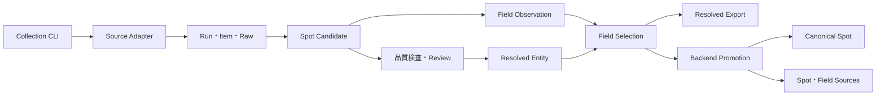

# Spotデータ収集機構 実装仕様書 v1

## 目次

<inline-toc preview="3"></inline-toc>

## 目的

実装済みのSpotデータ収集機構について、コード上の責務、処理フロー、CLI、永続化、名寄せ、公開処理、運用上の制約を一つの文書から追跡できるようにする。

本書は計画ではなく、2026年10月10日時点の実装とDocker上のDBを基準にしたas-built仕様である。

## 背景

当初の基本設計後に、OSM PBFのストリーム収集、九州OpenData、checkpoint再開、Entity Resolution、Entity単位のCanonical公開、一括実行、月次実行用entrypointが追加された。既存の手順書にはPBFを未実装とする古い記述が残っているため、現在のプログラムを基準にした実装仕様を別文書として固定する。

## ゴール

- 収集開始からCanonical公開までの入出力と責務を説明できる。
- Source追加、障害調査、再開、ExportをコードとDBの両方から追跡できる。
- 実収集件数と、履歴を含むDB物理行数、公開Spot件数を混同しない。
- 未承認Sourceや未設定の自動運用を、実装済み機能として誤認しない。

## 対象範囲

### 対象

- `data_collection` の収集Worker、設定、migration、schema、scripts、tests
- OSM Overpass／PBF、OpenData、Manual Seed、OpenAI Discovery、承認済みWeb Adapter
- checkpoint、retry、refresh、Run／Batch再開
- Entity ResolutionとField採用
- Candidate／Resolved Export
- `backend` のEntity単位Canonical Promotionとprovenance
- PostgreSQL advisory lockを使う定期実行entrypoint

### 対象外

- iOSアプリと推薦APIの画面・推薦ロジック
- 未承認Web Sourceの利用条件審査
- Windows Task SchedulerやクラウドSchedulerへのジョブ登録
- Review Taskを処理する管理画面
- HondaGO、Webike、公式観光サイトの実収集開始

## 対象ファイル

### 収集Worker

- `data_collection/src/collection_worker/cli.py`: CLIと終了コード
- `data_collection/src/collection_worker/pipeline.py`: Run／Batch制御、再開、正規化の統合
- `data_collection/src/collection_worker/repository.py`: DB永続化、checkpoint、retry、Review Task
- `data_collection/src/collection_worker/adapters/`: Source別の発見・取得
- `data_collection/src/collection_worker/resolution.py`: Entity ResolutionとField選択
- `data_collection/src/collection_worker/quality.py`: 地域、必須項目、重複などの品質検査
- `data_collection/src/collection_worker/exporter.py`: Candidate／Resolved Export
- `data_collection/src/collection_worker/regions.py`: N03行政区域の同期と境界解決

### 設定・DB・実行入口

- `data_collection/config/sources.yaml`: Source、profile、region group
- `data_collection/config/kyushu_source_inventory.yaml`: 九州OpenDataの審査状態
- `data_collection/migrations/001_initial.sql`: 収集基盤の初期schema
- `data_collection/migrations/002_resolution_batches.sql`: Batch、Entity、Field選択の追加schema
- `data_collection/scripts/collect_all.py`: 一括収集の薄いwrapper
- `data_collection/scripts/sources/`: Source個別の薄いwrapper
- `data_collection/scripts/run_scheduled_collection.py`: advisory lock付き定期実行entrypoint

### Canonical公開

- `backend/src/bike_easyfinder_api/promotion.py`: EntityからCanonical Spotへの反映
- `backend/alembic/versions/0004_entity_promotion_provenance.py`: Entity参照とprovenance制約

## システムの役割

本機構は、外部Sourceから取得したレコードをSource別Candidateとして保存し、Candidateを削除せずEntity membershipで名寄せする。その後、Fieldごとに採用Observationを選び、Backendが1 Entityを1 Canonical Spotとして公開する。



## 構造

### Adapter契約

`SourceAdapter.iter_pages(region, limit, checkpoint)` は `DiscoveryPage` を順次返す。各Pageは次を持つ。

- `records`: 取得レコード
- `checkpoint`: `offset`、`page`、`last_item`、`updated_at`
- `complete`: Source走査が完了したか

既存の `discover()` しか実装しないAdapterは、基底クラスが `checkpoint_every` 件単位のPageへ変換する。現在の既定値は100件である。

### Source Adapter

- `osm_overpass`: 小規模取得用。PBFと共通のOSM正規化処理を使う。
- `osm_pbf`: `osmium`でnode、way、areaをストリーム処理する。N03 bboxで事前絞り込み後、境界内判定を行う。
- `public_open_data`: CSV、JSON、GeoJSONを列mappingで共通形式へ変換する。
- `manual_seed`: レビュー済みJSONLなどを取り込む。
- `openai_web_discovery`: 候補URLを発見し、新規domainを `pending_review` として登録する。
- `official_web`／`general_web`／`touring_media`: 承認済みSourceだけを対象に、robots、redirect先domain、rate limitを検査してHTML本文を抽出する。

`official_web`、`general_web`、`touring_media` の設定済みSourceは、利用条件の確認が終わるまで `pending_review` であり、現行profileからは実行されない。

### OSM PBF cacheとprovenance

PBFは `extract_path` があればローカルファイルを、なければ `extract_url` を使用する。ダウンロードは一時ファイルからatomic renameし、ETag、Last-Modified、SHA-256、取得日時をcache metadataへ保存する。

一括実行中は同じPBFスナップショットを共有する。Observationの `source_payload` にはOSM原典URLとPBF取得元、SHA-256を保持し、Exportまで継承する。

実収集に使用した固定スナップショットは次のとおりである。

- URL: `https://download.geofabrik.de/asia/japan/kyushu-261005.osm.pbf`
- SHA-256: `2aca6871c596300d4bba9c2f24a19e1c1eed950736c06287aaa95a1b815d6acd`

### OpenData

データセットは公開主体・ライセンス単位でSourceを分ける。現行の一括実行対象は次の2 Sourceである。

- `nagasaki_tourism_open_data`: ながさき旅ネット観光スポット情報、CC BY 4.0
- `kumamoto_tourism_open_data`: 熊本県観光施設一覧、CC BY 4.0

設定は `dataset_id`、URL、format、encoding、ID列、必須列、列mapping、更新日、対象地域コードを持つ。必須列欠落とID重複は恒久Sourceエラーとして扱う。任意列だけの増減を含む完全なschema差分履歴は未実装であり、現状のschema drift検出は `expected_columns` の欠落検査である。

## 処理フロー

### 単一Run

1. CLIが地域コード、Source、mode、limitを検証する。
2. N03から対象Regionと境界、地域データ版を解決する。
3. 設定hash、schema version、地域データ版をRunへ固定する。
4. Source Adapterがcheckpoint以降のPageを返す。
5. レコード単位でRun Item、Raw、Candidate、Observationを冪等upsertする。
6. 一時エラーは `attempt_count` と `next_retry_at` を更新する。上限到達または恒久エラーはReview Taskへ送る。
7. 品質検査後、Entity ResolutionとField選択を実行する。
8. metrics、errors、checkpointと最終statusをRunへ保存する。

### 一括Batch

`collect-all` はregion groupの地域ごとに、profile中の適用可能Sourceを子Runとして実行する。1 Sourceが失敗しても後続Sourceと後続地域を継続する。

- `fukuoka-pilot`: 福岡県、`osm_pbf` とレビュー済みSeed
- `kyushu-p0`: 九州7県、`osm_pbf`、長崎・熊本OpenData

全成功時の終了コードは0、一部失敗は2である。入力不正、Policy違反、基盤障害は既存の終了コード3、4、5を維持する。

### refreshと再開

- `refresh` は同じcontent hashなら再正規化を省略する。
- 前回存在したSource recordが見つからない場合、即時削除せず `not_seen_since` と `SOURCE_RECORD_MISSING` Review Taskを設定する。
- Run再開時は設定hash、schema version、地域データ版の一致を検査する。
- 完了済みSourceはcheckpointの `complete=true` によりスキップする。
- 一時失敗itemは `next_retry_at` 到来後だけ再処理する。

CLIの `--failed-only` は現在常にtrueを既定値として受け取るが、falseへ切り替える分岐はPipelineへ未接続である。実際の再開動作は常に未完了Source／再試行対象のみである。

## Entity Resolution

### 永続化

- `resolved_spot_entities`: 安定Entity key、代表Candidate、状態、rule version、統合先
- `spot_entity_memberships`: Candidate所属、match score、判定、根拠
- `entity_field_selections`: Fieldごとの採用Observation、score、理由
- `review_tasks.entity_id`: CandidateまたはEntityの排他的なレビュー対象

### 候補ペアと判定

候補ペアは、同じ地域で250m以内かつ名称類似度0.8以上、または正規化official URL一致で生成する。点数は名称、距離、住所、URL、Source categoryから算出する。

- 75点以上: 自動統合
- 55〜74点: `ENTITY_MATCH_AMBIGUOUS`
- 54点以下: 別Entity
- 同一Source内: 自動統合せずレビュー
- 250m超: URL一致だけでは自動統合しない

Entity統合後もCandidateを削除しない。古いEntityは `merged_into_entity_id` で追跡する。

## Field選択とCanonical公開

Field選択はSource種別、license、confidence、検証時刻、取得時刻を評価する。名称、営業時間、営業状態、駐車場、アクセスは公式Source、座標はOSMを優先する。優先score差が10点未満で値が異なる場合は `SOURCE_CONFLICT` を作成する。

Backend Promotionは `ready` Entityごとに次を実行する。

1. 選択済みObservationから `spots` をupsertする。
2. Entity keyを `spots.canonical_key` とする。
3. 全出典を `spot_sources` に保存する。
4. Fieldごとの採用元を `spot_field_sources` に保存する。
5. 必須Fieldが不足するEntityは公開せず `CANONICAL_REQUIRED_FIELD_MISSING` を作成する。
6. 現在の対象Entityに存在しない既存Spotは `retired` にする。

## CLIインターフェース

### 九州7県の一括収集

```powershell
docker compose run --rm worker `
  python -m collection_worker collect-all `
  --profile kyushu-p0 `
  --region-group kyushu `
  --mode initial
```

### 月次refresh

```powershell
docker compose run --rm worker `
  python scripts/run_scheduled_collection.py `
  --profile kyushu-p0 `
  --region-group kyushu `
  --mode refresh
```

実コンテナ内ではscript pathはimage配置に合わせる。entrypointはPostgreSQL advisory lockを取得し、同一profile・region groupの重複実行時は `skipped` を返す。OSの月次スケジュール登録は別途必要である。

### Batch再開

```powershell
docker compose run --rm worker `
  python -m collection_worker batches resume <batch_id> --failed-only
```

### 結果確認とResolved Export

```powershell
docker compose run --rm worker `
  python -m collection_worker batches show <batch_id>

docker compose run --rm worker `
  python -m collection_worker export `
  --run-id <run_id> `
  --view resolved `
  --format jsonl
```

`--view candidate` は既存互換、`--view resolved` はEntityと採用Fieldを `resolved-spot-v1` として出力する。

## データ取得実績

### 件数の定義

本機構では次の件数を区別する。

- 取得件数: 最新成功Runが発見したSource record数。Source間の重複を含む。
- Batch実績: 指定Batch内の全子Runが発見したrecord数。
- 物理Candidate行数: 過去の検証、再実行、旧境界判定を含むDB履歴。
- Canonical Spot数: 名寄せと必須Field判定後にBackendが公開した件数。

### 最新成功RunのSource別取得件数

2026年10月10日（JST）のDB再照会結果である。

| 都道府県 | OSM PBF | OpenData | 合計 |
|---|---:|---:|---:|
| 福岡県 | 8,490 | 0 | 8,490 |
| 佐賀県 | 1,672 | 0 | 1,672 |
| 長崎県 | 3,160 | 1,123 | 4,283 |
| 熊本県 | 2,976 | 391 | 3,367 |
| 大分県 | 3,388 | 0 | 3,388 |
| 宮崎県 | 2,376 | 0 | 2,376 |
| 鹿児島県 | 5,429 | 0 | 5,429 |
| **合計** | **27,491** | **1,514** | **29,005** |

九州一括初回収集Batch `6365da56-b31d-4ea2-9986-6484618a4d30` は、7地域・9子Run・29,000件、エラー0で完了した。その後、福岡・佐賀・長崎のOSM PBFを固定スナップショットでrefreshしたため、最新成功Runの合計は29,005件である。refresh分を初回Batchへ加算して34,000件などと数えない。

### Canonical公開件数

| 都道府県 | 公開Spot数 |
|---|---:|
| 福岡県 | 7,894 |
| 佐賀県 | 1,536 |
| 長崎県 | 3,686 |
| 熊本県 | 2,836 |
| 大分県 | 3,019 |
| 宮崎県 | 2,118 |
| 鹿児島県 | 4,845 |
| **合計** | **25,934** |

公開Spotには `spot_sources` 25,938行、採用済み `spot_field_sources` 212,171行のprovenanceが保存されている。公開対象から外れた既存Spotは5,996件が `retired` で保持される。

### DB物理件数とレビュー

履歴を含む主な物理件数は次のとおりである。

- `spot_candidates`: 55,941件
- `field_observations`: 615,772件
- `resolved_spot_entities`: 40,250件
- `spot_entity_memberships`: 40,286件
- `entity_field_selections`: 316,104件

Entity状態は `ready` 25,967件、`review_required` 3,035件、`rejected` 11,243件、`superseded` 5件である。ready Entityのうち33件はCanonical必須Field不足のため未公開であり、25,934件が公開されている。

収集側の未解決Review Taskは5,969件である。主な内訳は `DUPLICATE_SUSPECTED` 4,628件、`OUTSIDE_REGION` 1,049件、`ENTITY_MATCH_AMBIGUOUS` 155件である。Backend側には `CANONICAL_REQUIRED_FIELD_MISSING` が33件ある。

## 依存関係

- PostgreSQL 16 + PostGIS 3.4
- Python 3.12系のWorker環境
- `osmium`: PBFストリーム処理
- `shapely`／PostGIS: 境界・距離判定
- Geofabrik: 九州PBF
- 国土数値情報N03: 行政区域境界
- BODIK: 長崎・熊本OpenData
- OpenAI API: Discovery／属性抽出を選択した場合のみ

通常CIは外部サイトへ実通信せずfixtureを使う。外部Sourceの到達性と規約は手動または定期smoke testで確認する。

## テストと確認結果

2026年10月6日の実装確認では次が成功した。

- data collection: 30 passed、1 skipped
- backend: 13 passed、1 skipped
- 九州7県Batch: completed、9子Run、29,000件、errors 0
- 福岡／佐賀／長崎PBF refresh: completed
- Backend Promotion: published 25,934件
- Resolved Export: 福岡県8,490行
- Scheduler entrypoint: `--help` 起動確認

fixtureではOSM node／way／area、境界内外、limit、checkpoint、OpenData形式、schema drift、Entity Resolution、Batch再開、PostGIS統合、Promotion provenanceを対象とする。

## 注意点と既知の制約

- `spot_candidates` の物理行数は取得件数や公開件数ではない。運用レポートでは最新RunとCanonicalを使用する。
- Source間には重複があるため、29,005件をそのまま公開Spot数として扱わない。
- 公式観光Web、HondaGO、Webikeは `pending_review` であり、承認前に自動fetchしない。
- OpenAI Discoveryが登録したdomainも `pending_review` であり、承認済みWeb Adapterへ自動接続しない。
- Windows Task SchedulerまたはクラウドSchedulerへの登録は未実施である。現状は実行entrypointまでが実装範囲である。
- `--failed-only=false` の切替動作は未実装であり、再開は常に未完了部分だけを対象にする。
- 古い運用手順書のPBF未実装という記述は現状と一致しない。本書とコードを実装状況の基準とする。

## リスクと影響範囲

- PBFやN03の版を変更すると境界判定と件数が変わる。Run再開ではなく新規Runを開始する。
- Source規約やrobots変更時は自動収集を停止し、`source_registry` の承認状態を見直す。
- Field選択ruleを変更するとCanonical値が変わり得るため、rule versionを更新して再計算する。
- Entity Resolutionの閾値変更は誤統合を生む可能性がある。Candidateを保持し、Review Taskとmembership evidenceで監査する。
- Promotion再実行は対象外Spotを `retired` にするため、対象県とdata versionを確認してから実行する。

## 未確認事項

- 九州7県の公式観光Web、HondaGO、Webikeの利用条件・保存可否は未承認である。
- 月次自動実行の具体的な日時、実行ホスト、通知先は未決定である。
- 収集側Review Task 5,969件とBackend Review Task 33件の人手処理期限は未決定である。
