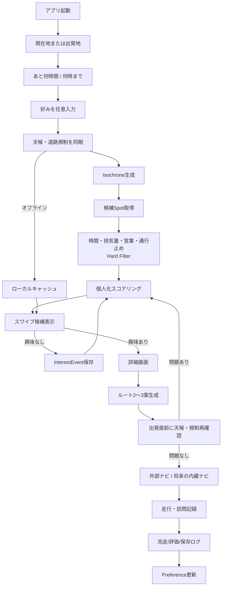

# バイクのツーリング先を簡単に見つけるアプリ：設計・実装要件調査

## エグゼクティブサマリ

本アプリの勝ち筋は、**「ナビアプリをもう一つ作る」ことではない**。既存のバイク向けサービスは、NAVITIME「ツーリングサポーター」のように、排気量を考慮したルート、二輪車規制、景観優先ルート、走行ログ、オフラインナビまで既に高度に実装している。海外でも calimoto、Kurviger、REVER、Detecht が、ワインディング重視ルーティング、オフライン地図、ログ、コミュニティ、安全機能を提供している。citeturn2view0turn2view1turn11search29turn9view3turn9view1turn9view2

したがって、狙うべきコア価値は、

> **「今から4時間空いている。ここからどこに行けば楽しいか」を数十秒で決められること**

である。

調査した主要競合の公式機能説明では、**「可処分時間 → 到達可能圏 → 天候・通行止め・営業時間で絞り込み → 個人嗜好でランキング → スワイプで継続学習」**をプロダクトの中心に据えているサービスは確認できなかった。これは調査対象に基づく推論であり、市場全体に存在しないという意味ではない。citeturn2view1turn11search29turn9view3turn9view1turn9view2

**推奨するMVPはフル機能ナビを作らない。** 「目的地発見・パーソナライズ・時間内に帰れる保証」に集中し、走行開始後はNAVITIMEやGoogle Maps等への外部ナビ連携、または最低限のルート表示とする。フルターンバイターン、完全オフライン再探索、ライブ交通は第2段階以降でよい。ここを欲張ると、既存ナビ企業の最も強い領域に正面衝突し、開発量と法務・地図ライセンス・安全責任だけが急増する。

想定ユーザは未指定のため、**日本国内の一般的なバイク所有者、主に日帰りツーリング**とする。MVP工数は、外部ナビ連携を前提として**約16〜22人月、4〜6人で4〜5か月**が現実的な目安である。リアルタイム道路情報・オフラインマップ・UGCを含む実用βまでなら**24〜32人月、6〜8か月程度**、フルオフライン二輪ナビまで自前で実装すると**32〜46人月以上**を見るべきである。これは設計概算であり、商用地図・気象・交通データの契約費は**未指定**。

## 目的・想定ユーザと競争戦略

### プロダクトの目的

主要ジョブは「道案内」ではなく、**ツーリング先を決める意思決定コストを消すこと**である。

典型的な利用状況は、

「日曜の朝10時、16時まで空いている。現在地は横浜。海か山に行きたい。昨日箱根には行った。雨は避けたい。昼食と給油を含めて、時間内に戻れる候補を3〜10件出してほしい」

というものになる。

最優先KPIは「検索回数」や「画面滞在時間」ではなく、**提案から実際の走行開始までの転換率**とすべきである。具体的には `recommendation → detail → route_start` のファネルを中心に計測する。

想定ユーザ属性は以下とする。

| 項目 | 想定 |
|---|---|
| 主ユーザ | 一般的なバイク所有者 |
| 利用地域 | 日本国内 |
| ツーリング | 主に日帰り |
| 排気量 | 原付二種〜大型まで。排気量による道路制約を考慮 |
| 利用時間 | 2〜10時間程度 |
| 主目的 | 絶景、ワインディング、カフェ、食事、温泉、道の駅、海、山、観光 |
| IT習熟度 | 一般スマートフォン利用者 |
| 出発地点 | 現在地または任意地点 |
| 帰着条件 | 「あとN時間」または「○時までに帰宅」 |
| 同行者 | ソロを基本。マスツーリングは将来対応 |
| 課金方針 | 未指定 |

### 競合比較

国内で最も直接的なベンチマークはNAVITIME「ツーリングサポーター」である。排気量、二輪車規制、景観優先ルート、最大100地点の経由地、ガソリンスタンド等の沿道施設、ログ、オフラインナビまで持っており、ナビ領域で正面対決するのは合理的ではない。2026年9月時点でApp Storeでは4.6、約2.9万件の評価が確認できる。公式料金は無料、Premium 月600円／年5,700円、Premium Plus 月1,000円／年9,800円等である。citeturn2view1turn12search11

| サービス | 主な必須・主要機能 | 差別化ポイント | 料金モデル | 規模・評価 |
|---|---|---|---|---|
| **NAVITIME ツーリングサポーター** | 二輪ナビ、排気量・規制考慮、景観ルート、ログ、GS/駐車場、オフライン | 日本の二輪ナビに強い | 無料 / Premium 月600円・年5,700円 / Plus 月1,000円・年9,800円等 | App Store 4.6、約2.9万評価。citeturn2view1turn12search11 |
| **calimoto** | Scenic routing、周回、ナビ、ログ、コミュニティ、オフライン | 景観・曲がり道中心の世界的バイクUX | Freemium + Premium。固定価格は地域・ストア依存につき本調査では未指定 | 公式/ストア説明で300万人超のライダー。citeturn11search13turn11search17 |
| **Kurviger** | Curvy routing、経由地、道路回避、ナビ、オフライン | 「曲がった道」を細かく制御 | Free / Tourer €14.99年 / Tourer+ €29.99年 | 公式で50万人超の利用者、アプリ60万DL超。citeturn9view3turn10view0 |
| **REVER** | ルート作成、追跡、オフライン、音声ナビ、友達追跡 | コミュニティ、Butler Maps、ADV用途 | PRO $39.99/年 | 公式サイトで3,000以上のロードトリップマップを掲載。ユーザ数は本調査では未確認。citeturn9view1turn10view2 |
| **Detecht** | ルート、ナビ、ログ、コミュニティ、クラッシュ検知、安全共有 | 安全機能が強い | 月$7.99、年$60等 | 150か国以上、10万以上のルートを公式掲載。ユーザ数は未確認。citeturn9view2turn10view1 |
| **Pioneer MOTTO GO** | バイク向けナビ、音声・画面案内 | 国内バイク専用ナビ | 現行料金：未指定 | Pioneerは2026年8月6日にMOTTO GO/COCCHiのサービス終了を発表。新規事業では撤退事例として見るべき。citeturn13search20 |

比較で重要なのは、**ナビ、ログ、オフラインという機能自体は差別化にならない**ことである。Kurvigerはオフラインやワインディング、REVERはオフラインとコミュニティ、Detechtは安全、NAVITIMEは国内道路規制まで既に押さえている。citeturn9view3turn9view1turn9view2turn2view1

狙う差別化は次の組み合わせである。

**時間予算ファースト × 日本のリアルタイム制約 × 個人嗜好学習 × 目的地発見。**

特にホーム画面を検索フォームではなく、

> 「あと4時間」→「海 / 山 / おまかせ」→候補カード

まで削るべきである。

## 必要なデータモデル

位置情報を扱うため、RDBMSは **PostgreSQL + PostGIS** を基本とする。地点は `GEOGRAPHY(Point,4326)`、ルートは `GEOGRAPHY(LineString,4326)`、非定型な外部メタデータは `JSONB` が扱いやすい。

`必須` はレコード生成時の必須属性、`任意` は取得できないケースを許容する属性を意味する。

| エンティティ | 主要属性・型・必須性 | 主なリレーション |
|---|---|---|
| **User** | `id UUID 必須`、`created_at TIMESTAMPTZ 必須`、`locale VARCHAR 必須`、`home_area GEOGRAPHY(Point) 任意`、`consent_version VARCHAR 必須` | MotorcycleProfile、PreferenceProfile、VisitHistory等と1:N |
| **MotorcycleProfile** | `id UUID`、`user_id UUID`、`displacement_cc INT 必須`、`vehicle_class ENUM 必須`、`fuel_range_km INT 任意`、`etc BOOL 任意` | User N:1 |
| **AvailabilityWindow** | `user_id`、`start_at TIMESTAMPTZ 必須`、`must_return_at TIMESTAMPTZ 必須`、`origin GEOGRAPHY(Point) 必須` | RecommendationRequestに紐付く |
| **PreferenceProfile** | `user_id`、`scenery FLOAT`、`curves FLOAT`、`food FLOAT`、`cafe FLOAT`、`onsen FLOAT`、`coast FLOAT`、`mountain FLOAT`、`avoid_highway FLOAT` 等 | User 1:1 |
| **Spot** | `id UUID`、`name TEXT 必須`、`location GEOGRAPHY(Point) 必須`、`category ENUM[] 必須`、`description TEXT 任意`、`avg_dwell_min INT 任意`、`opening_hours JSONB 任意`、`official_url TEXT 任意`、`confidence FLOAT 必須` | Photos、Ratings、Parking、Events等 |
| **SpotTag** | `spot_id`、`tag ENUM/TEXT`、`weight FLOAT` | Spot N:M Tag |
| **SpotSource** | `spot_id`、`source_type ENUM 必須`、`source_id TEXT 任意`、`source_url TEXT 任意`、`last_verified_at TIMESTAMPTZ 必須`、`license ENUM 任意` | Spot N:1/N |
| **Photo** | `id UUID`、`spot_id`、`uploader_id 任意`、`object_url TEXT 必須`、`captured_at 任意`、`moderation_status ENUM 必須`、`license ENUM 必須` | Spot/User |
| **Rating / Review** | `id`、`user_id`、`spot_id`、`rating SMALLINT 必須`、`text TEXT 任意`、`created_at` | User ↔ Spot |
| **VisitHistory** | `user_id`、`spot_id 任意`、`route_id 任意`、`visited_at`、`duration_min 任意`、`completion_confidence FLOAT` | User N:M Spot/Route |
| **RecommendationImpression** | `id`、`user_id`、`spot_id`、`rank INT`、`score FLOAT`、`model_version`、`shown_at` | 学習・評価用 |
| **InterestEvent** | `user_id`、`spot_id`、`action ENUM(like,skip,dislike,save,open,start)`、`context JSONB`、`created_at` | 暗黙フィードバック |
| **Route** | `id UUID`、`origin`、`destination`、`geometry GEOGRAPHY(LineString)`、`distance_m INT`、`duration_sec INT`、`route_type ENUM`、`generated_at` | Waypoint/Segment |
| **RouteWaypoint** | `route_id`、`seq INT`、`location Point`、`spot_id 任意`、`stop_min INT` | Route 1:N |
| **RouteSegment** | `route_id`、`seq`、`geometry LineString`、`road_class`、`curvature FLOAT 任意`、`elevation_gain INT 任意`、`risk_score FLOAT` | Route 1:N |
| **WeatherSnapshot** | `location/grid_id`、`valid_at`、`rain_mm FLOAT`、`temp_c FLOAT`、`wind_mps FLOAT`、`weather_code`、`source`、`fetched_at` | Spot/RouteSegmentと空間結合 |
| **TrafficRestriction** | `id`、`geometry Point/LineString`、`type ENUM`、`vehicle_condition JSONB`、`start_at`、`end_at 任意`、`severity`、`source` | Routeとの空間交差 |
| **RoadCondition** | `segment/ref_id`、`state ENUM(normal,wet,snow,ice,unknown)`、`observed_at`、`confidence` | RouteSegment |
| **ParkingFacility** | `id`、`spot_id 任意`、`location`、`motorcycle_allowed BOOL`、`capacity INT 任意`、`fee JSONB 任意` | Spot近傍 |
| **FuelStation** | `id`、`location`、`brand 任意`、`opening_hours 任意`、`last_verified_at` | Route近傍検索 |
| **Event** | `id`、`spot_id/geometry`、`name`、`start_at`、`end_at`、`official_url`、`category` | Spot/地域 |
| **HazardReport** | `id`、`geometry`、`type ENUM`、`severity`、`source_type`、`reporter_id 任意`、`reported_at`、`expires_at`、`verification_status` | Routeと空間交差 |
| **OfflinePack** | `id`、`user_id`、`bbox/region`、`map_version`、`spot_version`、`restriction_synced_at`、`size_bytes` | User 1:N |

重要なのは `Spot` だけでなく **SpotSource と `last_verified_at` を一級データとして持つこと**である。「営業時間が書いてある」ことと「昨日公式サイトで確認した営業時間」は全く違う。特に通行止め、イベント、駐車場、営業時間ではデータの鮮度をランキングに反映させる必要がある。

さらに、機械学習を後から導入するためには `like/dislike` だけでは不十分で、**何を何位に表示して、ユーザが何をしなかったか**を残す `RecommendationImpression` が必須になる。

```mermaid
erDiagram
    USER ||--o{ MOTORCYCLE_PROFILE : owns
    USER ||--|| PREFERENCE_PROFILE : has
    USER ||--o{ AVAILABILITY_WINDOW : enters
    USER ||--o{ INTEREST_EVENT : produces
    USER ||--o{ VISIT_HISTORY : creates
    USER ||--o{ RECOMMENDATION_IMPRESSION : receives

    SPOT ||--o{ SPOT_SOURCE : sourced_from
    SPOT ||--o{ PHOTO : has
    SPOT ||--o{ RATING : receives
    SPOT ||--o{ EVENT : hosts
    SPOT ||--o{ PARKING_FACILITY : near
    SPOT ||--o{ INTEREST_EVENT : target
    SPOT ||--o{ VISIT_HISTORY : visited

    ROUTE ||--o{ ROUTE_WAYPOINT : contains
    ROUTE ||--o{ ROUTE_SEGMENT : contains
    ROUTE ||--o{ VISIT_HISTORY : ridden

    ROUTE_SEGMENT }o--o{ TRAFFIC_RESTRICTION : intersects
    ROUTE_SEGMENT }o--o{ ROAD_CONDITION : has
    ROUTE_SEGMENT }o--o{ WEATHER_SNAPSHOT : affected_by
    ROUTE_SEGMENT }o--o{ HAZARD_REPORT : affected_by

    SPOT }o--o{ FUEL_STATION : nearby
    USER ||--o{ OFFLINE_PACK : downloads
```



## データ収集と優先ソース

地図・道路の基盤にはOpenStreetMapが有力である。OSMのデータベースはODbLで提供され、帰属表示等の条件がある。一方で、`tile.openstreetmap.org` の公開タイルサーバは第三者アプリ向けの無料CDNではなく、標準タイルの大量取得やオフライン用プリフェッチは禁止されている。この区別を間違えると、開発後に地図基盤を作り直すことになる。citeturn4view1turn4view2

Google Places APIは施設検索、Place Details、写真、営業時間、レビュー等の地点情報を提供するため、POIカバレッジ補完に強い。商用実装ではGoogle Maps Platformの利用条件・保存条件を設計段階で確認する必要がある。citeturn4view0

道路状況についてはJARTIC、国土交通省道路情報提供システム、NEXCO各社を公式情報源として優先する。NEXCO中日本の公式サイトでも、渋滞、交通規制、料金・ルート、SA/PA情報等が提供されている。citeturn6view0turn6view1turn18search1

気象については気象庁を一次情報源とする。ただし「Webページから取れる」ことと「商用アプリが安定したAPIとして再配信できる」ことは別問題なので、正式な利用条件・配信契約が必要な部分では商用気象APIも併用すべきである。気象庁は気象・防災関連情報を公式に公開している。citeturn3search31turn4view3

| 優先度 | データ | 第一候補 | 補完 | 実装上の扱い |
|---|---|---|---|---|
| **S** | 通行止め・重大規制 | JARTIC、国交省、NEXCO、道路管理者 | UGC | 安全に直結。最新性優先。Route hard filter |
| **S** | 天候・警報 | 気象庁 | 契約気象API | 警報・豪雨等はhard filter候補 |
| **A** | 道路ネットワーク | OpenStreetMap | 商用道路DB | routing graphの基礎 |
| **A** | スポット/店舗 | 公式観光サイト、自治体、Google Places等 | OSM、UGC | 名寄せして統合 |
| **A** | 営業時間 | 施設公式サイト/Places | UGC | `last_verified_at` 必須 |
| **A** | 駐車場 | 施設公式、自治体、OSM、Places | UGC | 「二輪可」を独立属性化 |
| **A** | 給油 | Places、OSM、事業者情報 | UGC | ルート沿い検索 |
| **B** | 観光説明 | 都道府県・自治体・観光協会 | commercial POI/UGC | 著作権に注意し転載ではなく属性化 |
| **B** | イベント | 公式観光・自治体・施設 | UGC | 開催期間と取得日時を保持 |
| **B** | 写真 | 施設公式ライセンス、UGC、Places | — | 出典・利用権を写真単位で保持 |
| **C** | 危険情報 | 公的情報 | UGC | UGCは未確認/確認済みを明示 |

### データ統合パイプライン

基本構造は、

`Source Adapter → Raw Storage → Normalize → Geocode/Entity Resolution → Quality Check → Canonical DB → Search Index`

とする。

同一施設が「道の駅 富士吉田」「道の駅ふじよしだ」「Michi-no-Eki Fujiyoshida」のように複数ソースに存在するため、地点距離、電話番号、名称類似度、公式URL等を使ったEntity Resolutionが必要になる。

ソースごとに次を必ず保持する。

`source_id / source_url / source_type / retrieved_at / valid_from / valid_to / license / confidence`

**スクレイピング主体のプロダクトにしてはいけない。** 公式サイトは重要だが、HTML構造変更、robots、利用規約、著作権、更新頻度で運用コストが跳ねる。公式オープンデータ/API→契約データ→構造化スクレイピング→UGCの順で使うべきである。

## マッチング・ルーティング仕様

### 入力

最低限必要なのは次の6つである。

`出発地 / 利用可能時間または帰着時刻 / 車両・排気量 / ざっくりした嗜好 / 過去訪問 / スワイプ履歴`

毎回ユーザに大量の質問をしてはいけない。初回は「景色」「ワインディング」「食事」「カフェ」「温泉」程度を選ばせ、以後は行動ログから更新する。

### 候補生成

利用可能時間を `T` とすると、

\[
T \geq T_{outbound}+T_{stay}+T_{return}+T_{buffer}
\]

を満たすスポットだけ候補にする。

例えば4時間なら単純な半径検索ではなく、**道路ネットワーク上の到達時間等時線（isochrone）**を使う。山岳道路、高速道路、都市部では直線距離が同じでも所要時間が全く異なるためである。

GraphHopperは公式APIでIsochrone、Matrix、Custom Modelによるルーティング条件調整を提供しており、この用途と相性が良い。citeturn7search5turn7search16turn7search31

候補生成の推奨順序は、

1. 出発地・帰着時間から最大移動時間を計算
2. routing isochroneで到達可能圏を生成
3. 空間検索でSpotを取得
4. 施設滞在時間を加算
5. 復路所要時間をMatrix API等で計算
6. 帰着制約違反を除外
7. ハード制約を適用
8. 残候補を個人化ランキング

とする。

### ハードフィルタ

ランキングより先に除外すべき条件は、

- 通行止め・災害等で経路成立不能
- 車両区分・排気量と道路制限の不一致
- 帰着時刻に間に合わない
- 到着時点で施設が営業していない
- 悪天候が設定した安全閾値を超える
- ユーザが明示的に「絶対行きたくない」と設定したカテゴリ
- 必須給油条件を満たさない長距離区間

である。

「雨だからスコアを10%下げる」と「大雨警報級だから候補から外す」は別処理にする。

### スコアリング

MVPでは説明可能なルールベース＋コンテンツベースを使う。

例えば、

\[
Score =
0.28P +
0.18N +
0.15R +
0.12T +
0.10W +
0.07Q +
0.05F +
0.05E - Penalty
\]

とする。

ここで、

- `P`: Preference Match — 景色・食・温泉等との適合
- `N`: Novelty — 未訪問・最近見ていない
- `R`: Route Enjoyment — 曲率、標高変化、景観道路等
- `T`: Time Fit — 時間を無駄なく使えるか
- `W`: Weather Fit
- `Q`: Spot Quality / データ信頼度
- `F`: Fuel/Parking等の利便性
- `E`: Exploration bonus
- `Penalty`: 再訪過多、鮮度低下、リスク等

とする。

**上記の重みは仕様案であり実証値ではない。** ローンチ後のイベントデータで調整する。

特に「スワイプ左」を即「嫌い」と解釈してはいけない。ユーザは「今日は温泉じゃない」「4時間では遠い」という理由でもスキップする。したがって `dislike`, `skip`, `shown-but-no-action` を別イベントにする必要がある。

### 推薦アルゴリズムの進化

| 段階 | アルゴリズム | 利点 | 弱点 | 採用判断 |
|---|---|---|---|---|
| MVP | ルールベース | 説明可能、データ不要、安全制約を管理しやすい | 個人化が弱い | **必須** |
| MVP | コンテンツベース | コールドスタートに強い | 似た候補に偏る | **必須** |
| 成長期 | Item/User協調フィルタリング | 他ユーザの行動から発見できる | ユーザ数が少ないと弱い | P1 |
| 成長期 | BPR等のImplicit Ranking | Like/Save/Start等に適する | バイアス管理が必要 | P1 |
| 成熟期 | Learning to Rank | 時間・天候・距離・個人属性を統合可能 | 学習ログ、検証基盤が必要 | P2 |

BPRはクリック・購入などの暗黙的フィードバックを「個人化ランキング」として直接最適化する手法として提案されたもので、スワイプや保存ログにも考え方を転用できる。citeturn16academia35

ただし**最初からAI推薦を作るのは間違い**である。データのない段階では高性能モデルではなく複雑な乱数生成器になる。まずルール＋コンテンツベースでインプレッション、スワイプ、詳細表示、保存、走行開始、完走を大量に記録し、その後協調フィルタリング/LTRへ進むべきである。

### ルート生成と所要時間

ルート候補は最低でも、

- 最短時間
- 景観・ワインディング重視
- 高速道路回避

の2〜3案を作る。

「楽しい道路」の代理特徴として道路曲率、標高差、主要道路比率、信号推定密度、景観タグ、渋滞、舗装種別等を利用する。

所要時間は、

`routing engine baseline + 時刻/曜日補正 + live traffic（利用権がある場合） + 休憩/滞在時間`

で算出する。

ここで重要なのは**ETAに安全側のバッファを入れること**である。「4時間プラン」で4時間00分の旅程を出す設計は粗悪である。例えば全体の10〜15%または最低30分の余裕を持たせるなど、プロダクト仕様として余裕時間を定めるべきである。

### リアルタイム・オフライン

オフライン時は、

`保存済み候補 + 保存済みルート + ベクトル地図 + 最終同期時点の規制情報`

を利用する。

ただし通行止めや天候はオフラインでは更新できないため、

> 「道路・天候情報：09:12時点。現在はオンライン確認できません」

のように鮮度を明示する。

OSM標準タイルを一括ダウンロードしてオフライン地図を作る方式は利用ポリシー上不適切であり、セルフホストしたベクトルタイルや、オフライン利用を許可するプロバイダを使う必要がある。citeturn4view2 PMTilesは単一ファイルのタイルアーカイブとしてHTTP Range Request等で配信できる仕組みを提供しており、セルフホスト構成の候補になる。citeturn7search3turn7search7



### 評価指標

オフライン評価では `NDCG@K`、`HitRate@K`、`MRR`、Precision/Recallに加え、カテゴリ多様性、Noveltyを測る。

本番ではこちらの方が重要である。

| 指標 | 意味 |
|---|---|
| Recommendation → Detail CTR | 候補が興味を引いた率 |
| Save Rate | 行きたい候補として保存 |
| Route Generation Rate | 詳細からルート生成へ進む率 |
| **Ride Start Rate** | 実際のツーリング開始率。最重要 |
| Completion Rate | 想定プランを完走できた率 |
| Return-on-Time Rate | 指定帰着時間を守れた率 |
| Repeat Recommendation Use | 再利用率 |
| Diversity / Novelty | 同じ場所ばかり出していないか |
| Closure Conflict Rate | 規制道路を提案した割合 |
| Weather Risk Override | 危険天候候補が提案された割合 |
| P95 Recommendation Latency | 提案までの速度 |
| Data Freshness | 規制/営業時間/天候等の鮮度 |

クリック率だけを最適化すると、富士山・箱根・有名道の駅ばかり上位に出る可能性が高い。**「実際に走った」「時間内に帰れた」「また使った」まで最適化する必要がある。**

## UI/UX・システム設計

### UI/UX要件

ホーム画面で入力させるものは極力少なくする。

**時間入力**は「2h / 4h / 6h / 8h」「16:00まで」のクイック選択を用意する。距離ではなく時間を第一入力にする。

**スワイプカード**には写真だけでなく、

> 箱根・芦ノ湖  
> 往復3時間20分  
> 滞在45分  
> 山道多め  
> 15時42分帰着予定  
> 降水確率低  
> 未訪問

のように「なぜ今これを提案したか」を出す。

左右スワイプは、

`右 = 行きたい`  
`左 = 今回は違う`  
`長押し/メニュー = 今後も興味なし`

程度に分ける。「左＝永久に嫌い」はデータ設計として乱暴である。

**詳細画面**には以下を一画面で確認可能にする。

- 写真・概要
- 推薦理由
- 往復時間 / 滞在推奨時間 / 帰着予想
- 天気・気温・風
- 道路規制・危険情報
- 駐車場・二輪可否
- 最寄給油
- 営業時間
- ルート特性
- 情報の最終確認日時

**地図画面**ではルートだけでなく「ワインディング区間」「規制」「給油」「駐車」「雨域・危険」のレイヤを切替可能にする。

**通知**は、保存済みツーリングについて「明朝の天候悪化」「通行止め発生」「代替ルートあり」のような実用通知に限定すべきである。走行中に販促通知を出す設計は不要である。

**走行中操作**は積極的に抑止する。速度・モーション状態から走行中と推定できる場合はスワイプや複雑な検索UIを止め、必要なら音声と大きな操作だけにする。

### 推奨システム構成

| 層 | 第一候補 | 代替 |
|---|---|---|
| Mobile | **Flutter** | iOS Swift + Android Kotlin |
| Map Rendering | **MapLibre Native** | 商用Maps SDK |
| Offline Map | self-host vector tile + PMTiles/MBTiles系 | 商用offline SDK |
| Backend API | Go / Kotlin / TypeScript | Python FastAPI |
| DB | **PostgreSQL + PostGIS** | — |
| Cache | Redis | managed equivalent |
| Routing | **GraphHopper** | Valhalla、商用Routing API |
| Object storage | S3 / GCS | equivalent |
| Search | PostGISから開始 | OpenSearch/Elasticsearch |
| Recommendation | Backend rule engine → Python ML | managed ML |
| Analytics | BigQuery / ClickHouse | Snowflake |
| Queue | SQS / Pub/Sub | Kafkaは初期には過剰 |
| Push | FCM + APNs | — |
| Monitoring | OpenTelemetry + Sentry + cloud metrics | — |
| IaC | Terraform | cloud-native IaC |

FlutterをMVP候補にする理由は、一つのコードベースでiOS/Androidを高速に立ち上げるためである。ただし**本格的なバックグラウンドナビ、CarPlay/Android Auto、Bluetooth音声、OS依存GPS制御が主要機能になるならネイティブの価値が上がる**。

バックエンドは次のように分離するとよい。

`Recommendation API`  
`Spot API`  
`Route API`  
`Realtime Constraint Service`  
`User/Profile Service`  
`Data Ingestion Workers`

ただしMVPから物理的にマイクロサービス化する必要はない。**モジュラーモノリス + Worker** で開始し、負荷や組織が成長してから分割する方が合理的である。

API例は、

```text
POST /v1/recommendations
GET  /v1/spots/{spot_id}
POST /v1/routes
GET  /v1/routes/{route_id}
POST /v1/interactions
POST /v1/visits
GET  /v1/realtime/constraints
POST /v1/offline-packs
```

程度で足りる。

`POST /v1/recommendations` は例えば、

```json
{
  "origin": {
    "lat": 35.4437,
    "lng": 139.6380
  },
  "available_minutes": 240,
  "vehicle": {
    "type": "motorcycle",
    "displacement_cc": 400
  },
  "preferences": [
    "mountain",
    "curvy_roads",
    "cafe"
  ],
  "return_buffer_minutes": 30
}
```

に対して、

```json
{
  "generated_at": "2026-09-23T10:00:00+09:00",
  "candidates": [
    {
      "spot_id": "uuid",
      "estimated_total_minutes": 205,
      "return_eta": "2026-09-23T13:25:00+09:00",
      "score": 0.84,
      "reasons": [
        "未訪問",
        "ワインディングが多い",
        "時間内に往復可能"
      ],
      "constraints": {
        "weather": "ok",
        "road": "ok"
      }
    }
  ]
}
```

を返す形がよい。

## 実装ロードマップと概算工数

最も重要な優先順位は、**推薦が当たるか検証する前に本格ナビを作らないこと**である。

### フェーズ別ロードマップ

| フェーズ | 期間目安 | 優先度 | 実装タスク | 完了条件 |
|---|---:|---|---|---|
| **Discovery / Data契約** | 2〜3週 | P0 | ユーザ調査、ユースケース、データライセンス、OSM/Places/天候/道路情報検証、UX試作 | 主要データの取得・利用可否が判明 |
| **Data Foundation** | 4〜6週 | P0 | PostGIS、Spot schema、OSM/POI ingest、名寄せ、Source/Freshness管理、Routing POC | 1地域で候補・ルートを生成 |
| **MVP Backend** | 4〜6週 | P0 | Recommendation API、hard filter、rule/content score、Route API、interaction logging | 時間内候補をAPIで返せる |
| **MVP Mobile** | 6〜8週・並行 | P0 | オンボーディング、時間入力、スワイプ、詳細、地図、保存、外部ナビ連携 | end-to-endでツーリング開始可能 |
| **β / Safety** | 4〜6週 | P0 | 天気・道路規制統合、データ鮮度、QA、負荷、監視、プライバシー、走行中UI制限 | 公開β品質 |
| **Offline / UGC** | 6〜10週 | P1 | 地図パック、保存ルート、写真、評価、危険報告、モデレーション | 通信不安定地域でも基本利用可能 |
| **Personalization** | 6〜8週 | P1 | 協調フィルタ/BPR、実験基盤、探索・活用、多様性制御 | ルールベースをA/Bで上回る |
| **Advanced Navigation** | 8〜14週以上 | P2 | 内蔵ターンバイターン、offline reroute、音声、CarPlay/Android Auto等 | ナビプロダクトとして成立 |

一部は並行できるため、期間を単純加算する必要はない。

### 工数見積り

前提は「日本国内、iOS+Android、日帰り、Flutter、既存routing engineを利用、外部ナビ連携」である。

| 分野 | MVP概算 |
|---|---:|
| PM / 要件 / UX | 1.5〜2.5人月 |
| データ調査・契約・パイプライン | 2〜3人月 |
| Backend / API | 3〜4人月 |
| Geospatial / Routing | 2〜3人月 |
| Mobile | 4〜5人月 |
| 推薦・Analytics | 1〜2人月 |
| QA / Security / Release | 2〜3人月 |
| DevOps / Monitoring | 1〜1.5人月 |
| **合計** | **約16〜22人月** |

推奨チームは、

**PM/UX 1、Mobile 2、Backend/Geo 1〜2、Data/ML 1、QA 0.5〜1、DevOps兼務**

程度である。

したがって目安は、

| スコープ | 人月 | カレンダー期間 |
|---|---:|---:|
| 検証用Prototype | 5〜8 | 2〜3か月 |
| **推奨MVP** | **16〜22** | **4〜5か月** |
| 実用β：Realtime + Offline + UGC | **24〜32** | **6〜8か月** |
| フル内蔵二輪ナビ | **32〜46以上** | **8〜12か月以上** |

API利用料、商用POI、交通情報、気象データ、地図配信CDN、写真ストレージの月額費用は利用量と契約方式が不明なため**未指定**。

### テストで落としてはいけないケース

通常のUIテストより、地理的エッジケースが重要である。

「125ccで自動車専用道路を通らないか」「営業時間終了後に到着しないか」「フェリー時刻が旅程を破壊しないか」「山間部で電波断したらどうなるか」「通行止めが旅程作成後に発生したらどうするか」「時計上は間に合うが休憩ゼロの無理な旅程になっていないか」「同名スポットを誤名寄せしていないか」などをfixtureとして自動テストするべきである。

推薦についても単なるunit testでは足りず、固定された仮想ユーザ、

`海好き / 山好き / カフェ好き / 高速嫌い / 箱根訪問済`

に対してランキングの期待値をRegression Testとして固定するとよい。

## プライバシー・法務・運用上の留意点

### 位置情報

位置履歴はこのサービスの中核である一方、最も危険なデータでもある。自宅、勤務先、行動パターンを容易に推測できるため、法的分類の議論以前に高リスクデータとして扱うべきである。個人情報保護委員会は個人情報保護法および関連ガイドラインを公開している。citeturn17search9turn17search18

設計原則は、

`収集目的を明示 → 最小限収集 → 保存期間を限定 → ユーザ自身で削除 → 第三者提供を明示`

である。

生GPSログは永久保存しない。推薦のために「箱根に行った」という事実だけでよいなら、詳細軌跡を長期保存する理由はない。

ユーザの「自宅位置」も緯度経度をそのまま保存せず、可能なら数百m〜数kmの地域化や端末内保存を検討する。

### 写真・UGC

UGCには写真の著作権、顔・ナンバープレート、施設所有者とのトラブル、虚偽の危険情報等が発生する。

最低限、

`通報 → 非公開化 → 審査 → 復帰/削除`

のモデレーションフローが必要である。

写真アップロード時は不要なEXIF位置情報を原則除去し、ユーザ規約で「アプリ内表示・配信に必要な利用許諾」を明示する。運営会社が写真の著作権を全面譲渡させる必要は通常ない。

危険情報については、

> 「落石あり」

という1ユーザ投稿と、道路管理者の「全面通行止め」を同じ扱いにしてはいけない。

`official_verified / community_confirmed / unverified`

等の信頼レベルを持たせる。

### 地図・外部データのライセンス

OSMデータはODbLであり、帰属表示等のライセンス条件を守る必要がある。さらにOSM Foundationの公開タイルサーバには独自の利用ポリシーがあり、オフラインダウンロード用途には使えない。citeturn4view1turn4view2

Google Placesについても「APIから取れたデータだから自社DBに自由に永久保存できる」と考えてはいけない。取得・表示・キャッシュ・他地図との組み合わせ等をGoogle Maps Platformの契約条件に照らして設計する必要がある。Places APIが検索、Place Details、写真、営業時間、レビュー等を提供していることは公式ドキュメントで確認できる。citeturn4view0

データライセンスは開発終了後に法務確認するのでは遅い。**フェーズ0の技術要件**である。

### 道路法規と安全

ルートは常に**現地の標識・交通規制を優先**する前提で設計する。ナビデータの正確性を保証し切ることはできない。

さらに、本サービスはバイク用途である以上、一般アプリより強く「走行中に画面操作させない」設計が必要である。免責文を利用規約に一行入れるだけでは不十分で、走行状態推定時の複雑操作禁止、大きなUI、音声、停車後の再操作をプロダクト側で実装する。

### 最大の事業リスク

技術より先に警戒すべきなのは**データ品質と継続利用**である。

ユーザが一度でも、

「営業終了していた」  
「バイクを駐められなかった」  
「通行止めだった」  
「4時間と書いてあったのに6時間かかった」

を経験すると、推薦への信頼が崩れる。

したがってこのサービスの本当の資産は派手な生成AIではなく、

**Spotの鮮度、二輪道路制約、所要時間精度、ユーザ嗜好ログ**

になる。

また、Pioneerが2026年8月6日にMOTTO GOのサービス終了を発表した事実は無視すべきではない。一社の撤退だけで市場性がないとは言えないが、「高機能ナビを作れば課金される」という前提は危険である。citeturn13search20

したがって事業仮説はまず、

> **「目的地決めが面倒」という問題に、ユーザは継続的にアプリを開くほど困っているか**

をMVPで検証すべきである。

### 優先参考ソースURL

日本語・国内公式情報を優先すると、最初に確認すべきソースは以下になる。

| 分野 | URL |
|---|---|
| NAVITIME ツーリングサポーター | https://touring.products.navitime.co.jp/moto |
| 日本道路交通情報センター JARTIC | https://www.jartic.or.jp/ |
| 国土交通省 道路情報提供システム | https://www.road-info-prvs.mlit.go.jp/roadinfo/pc/ |
| 気象庁 防災情報 | https://www.jma.go.jp/bosai/ |
| NEXCO中日本 | https://www.c-nexco.co.jp/ |
| 個人情報保護委員会 | https://www.ppc.go.jp/personalinfo/ |
| e-Gov 道路交通法 | https://elaws.e-gov.go.jp/document?lawid=335AC0000000105 |
| OpenStreetMap Copyright / ODbL | https://www.openstreetmap.org/copyright |
| OSM Tile Usage Policy | https://operations.osmfoundation.org/policies/tiles/ |
| Google Places API | https://developers.google.com/maps/documentation/places/web-service/overview |
| GraphHopper API | https://docs.graphhopper.com/ |
| PMTiles | https://protomaps.com/docs/pmtiles/ |
| calimoto | https://calimoto.com/en |
| Kurviger | https://kurviger.com/en |
| REVER | https://www.rever.co/ |
| Detecht | https://www.detechtapp.com/ |

**最終的な推奨仕様は、「ナビアプリ」ではなく「時間制約付き・リアルタイム制約付き・個人化されたツーリング先推薦エンジン」として設計すること**である。ルーティングと地図は重要だが、それ自体を商品価値の中心に置くべきではない。NAVITIMEや海外競合が既にそこを強く押さえている。citeturn2view1turn9view3turn9view1turn9view2

MVPで検証すべき一本のファネルは、**「あと何時間」→「3〜10件の魅力的な候補」→「スワイプ」→「時間内ルート」→「実際に出発」**である。ここが成立してから、オフラインナビ、コミュニティ、AIランキング、CarPlay等へ広げるのが最も合理的である。